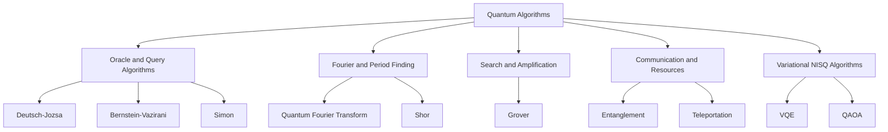

# Quantum Algorithms Handbook

Main reference for quantum algorithms in the repository: core ideas, equations, tradeoffs, and runnable examples in one place.

Each algorithm module contains:

- `README.md`: intuition, workflow, circuit map, complexity, applications, limitations.
- `theory.md`: conceptual explanation and why the algorithm works.
- `math.md`: derivation using linear algebra and Dirac notation.
- `implementation.py`: runnable Python example.
- `visualization.py`: circuit or state visualization helper.
- `circuits/`: location for exported diagrams, QASM, and snapshots.

## Quick Navigation

| Algorithm/resource | Main idea | Module |
|---|---|---|
| Entanglement | Nonclassical correlations as a computational resource. | [entanglement](entanglement/README.md) |
| Quantum Teleportation | Transfer an unknown qubit using entanglement and two classical bits. | [quantum_teleportation](quantum_teleportation/README.md) |
| Deutsch-Jozsa | Detect constant vs balanced functions with one oracle query. | [deutsch_jozsa](deutsch_jozsa/README.md) |
| Bernstein-Vazirani | Recover a hidden bit string with one oracle query. | [bernstein_vazirani](bernstein_vazirani/README.md) |
| Simon's Algorithm | Recover a hidden XOR mask with exponential oracle separation. | [simon_algorithm](simon_algorithm/README.md) |
| Grover Search | Quadratic speedup for unstructured search. | [grover_algorithm](grover_algorithm/README.md) |
| Quantum Fourier Transform | Convert computational-basis structure into phase/frequency structure. | [quantum_fourier_transform](quantum_fourier_transform/README.md) |
| Shor's Algorithm | Factor integers using quantum period finding. | [shor_algorithm](shor_algorithm/README.md) |

## Quantum Algorithm Cheat Sheet

| Algorithm | Problem solved | Speedup type | Core trick | Main limitation |
|---|---|---|---|---|
| Deutsch-Jozsa | Constant vs balanced oracle classification | Exponential query separation for a promise problem | Phase kickback plus interference | Artificial promise problem |
| Bernstein-Vazirani | Hidden linear string `s` in `f(x)=s dot x` | Linear query improvement | Phase kickback decodes hidden parity | Oracle model is idealized |
| Simon | Hidden XOR period `s` | Exponential oracle separation | Samples equations orthogonal to `s` | Requires promised two-to-one oracle |
| Grover | Unstructured search | Quadratic | Amplitude amplification | Oracle cost and noise depth matter |
| QFT | Fourier transform over amplitudes | Exponential transform compression | Controlled phase rotations | Measurement does not reveal all amplitudes |
| Shor | Integer factoring/order finding | Superpolynomial over known classical factoring | QFT plus modular exponentiation | Needs fault-tolerant scale for RSA-sized inputs |
| Teleportation | State transfer | Not a compute speedup | Entanglement plus classical correction | Requires entanglement distribution |
| Entanglement | Resource state preparation | Enables nonclassical protocols | Nonseparable joint states | Fragile under noise |

## Study Order

1. Entanglement: learn what makes quantum information nonclassical.
2. Teleportation: see entanglement, measurement, and correction work together.
3. Deutsch-Jozsa: learn phase kickback and interference.
4. Bernstein-Vazirani: learn how Hadamards decode parity.
5. Simon: learn hidden structure and linear algebra over GF(2).
6. Grover: learn amplitude amplification.
7. QFT: learn phase/frequency representation.
8. Shor: combine QFT, period finding, and number theory.

## Core Quantum Notation

### Qubits

A qubit is a normalized vector:

```text
|psi> = alpha|0> + beta|1>
|alpha|^2 + |beta|^2 = 1
```

Measurement in the computational basis returns:

```text
Pr(0) = |alpha|^2
Pr(1) = |beta|^2
```

### Multi-Qubit States

Two qubits live in a tensor-product space:

```text
|a>|b> = |a> tensor |b>
```

The computational basis for two qubits is:

```text
|00>, |01>, |10>, |11>
```

An `n`-qubit register has `2^n` amplitudes:

```text
|psi> = sum_x alpha_x |x>
```

### Unitary Evolution

Quantum gates are unitary matrices:

```text
U dagger U = I
```

This preserves total probability and makes isolated quantum operations reversible.

### Measurement

Measurement converts quantum amplitudes into classical outcomes. Algorithms are designed so useful answers have high probability after interference.

## Gate Cheat Sheet

| Gate | Matrix/action | Meaning |
|---|---|---|
| `X` | `X|0>=|1>`, `X|1>=|0>` | Bit flip |
| `Z` | `Z|0>=|0>`, `Z|1>=-|1>` | Phase flip |
| `H` | `H|0>=(|0>+|1>)/sqrt(2)` | Creates/interprets superposition |
| `S` | phase `i` on `|1>` | Quarter-turn phase |
| `T` | phase `exp(i*pi/4)` on `|1>` | Non-Clifford phase gate |
| `RX, RY, RZ` | rotations around Bloch axes | Parameterized variational gates |
| `CX` | flips target when control is `1` | Entangling controlled operation |
| `CZ` | phase flip on `|11>` | Controlled phase |
| `SWAP` | exchanges two qubits | Register rearrangement |

## Core Algorithmic Patterns

### 1. Superposition

Hadamards prepare many computational paths at once:

```text
H^n |0...0> = 1/sqrt(2^n) sum_x |x>
```

This does not mean all answers are read out. The algorithm still needs interference to make the useful answer measurable.

### 2. Phase Kickback

If the target is prepared in `|-> = (|0>-|1>)/sqrt(2)`, an oracle:

```text
U_f |x>|y> = |x>|y xor f(x)>
```

becomes:

```text
U_f |x>|-> = (-1)^f(x)|x>|->
```

The function value is kicked back as a phase on `|x>`.

Used by: Deutsch-Jozsa, Bernstein-Vazirani, Simon, Grover.

### 3. Interference

Quantum amplitudes can add or cancel. Algorithms arrange phases so wrong answers destructively interfere and useful answers constructively interfere.

### 4. Amplitude Amplification

Grover's algorithm rotates the state toward a marked subspace. It alternates:

```text
oracle reflection -> diffusion reflection
```

Two reflections form a rotation.

### 5. Fourier Sampling

The QFT maps periodic structure into measurable phase/frequency peaks:

```text
QFT |x> = 1/sqrt(N) sum_y exp(2*pi*i*x*y/N)|y>
```

Used by: phase estimation, order finding, Shor's algorithm.

### 6. Classical Post-Processing

Many quantum algorithms are hybrid. The quantum circuit samples information; classical code finishes the job:

- Simon: solve linear equations over GF(2).
- Shor: continued fractions and `gcd`.
- Grover: verify candidate answers.
- VQE/QAOA: classical optimizer updates parameters.

## Algorithm Families



## Entanglement

### What It Is

Entanglement occurs when a joint state cannot be factored into independent subsystem states. The canonical Bell state is:

```text
|Phi+> = (|00> + |11>) / sqrt(2)
```

Each individual qubit looks random, but their joint measurement outcomes are correlated.

### How It Functions

Prepare:

```text
|00> --H on q0--> (|00> + |10>)/sqrt(2)
     --CX q0,q1--> (|00> + |11>)/sqrt(2)
```

### Why It Matters

Entanglement is not just a strange physics effect. It is a resource for teleportation, error correction, quantum networking, and many algorithmic speedups.

### Pros

- Enables nonclassical correlations.
- Powers teleportation and distributed quantum protocols.
- Used in error-correcting codes and many hardware benchmarks.

### Cons

- Fragile under decoherence.
- Hard to distribute over long distances.
- Does not allow faster-than-light communication.

## Quantum Teleportation

### What It Solves

Teleportation transfers an unknown quantum state from Alice to Bob using one shared entangled pair and two classical bits.

### How It Functions

1. Alice has unknown state `|psi> = alpha|0> + beta|1>`.
2. Alice and Bob share `|Phi+>`.
3. Alice performs a Bell-basis measurement.
4. Alice sends two classical bits to Bob.
5. Bob applies one of `I`, `X`, `Z`, or `XZ`.

### Math Snapshot

```text
|psi>|Phi+> = 1/2[
|Phi+>|psi> +
|Phi->Z|psi> +
|Psi+>X|psi> +
|Psi->XZ|psi>
]
```

The measurement tells Bob which correction recovers `|psi>`.

### Pros

- Foundation for quantum networking.
- Demonstrates no-cloning and entanglement as a resource.
- Used in fault-tolerant gate teleportation.

### Cons

- Requires pre-shared entanglement.
- Requires classical communication.
- Does not copy the original state.

## Deutsch-Jozsa Algorithm

### Problem

Given a Boolean function:

```text
f: {0,1}^n -> {0,1}
```

promised to be either constant or balanced, determine which.

### Classical vs Quantum

| Method | Query complexity |
|---|---:|
| Deterministic classical worst case | `2^(n-1)+1` |
| Quantum | `1` |

### How It Functions

1. Prepare `|0...0>|1>`.
2. Apply Hadamards to all qubits.
3. Query `U_f`.
4. Apply Hadamards to input qubits.
5. Measure input register.

If the input register is all zeros, the function is constant. Otherwise it is balanced.

### Math Snapshot

After phase kickback:

```text
1/sqrt(2^n) sum_x (-1)^f(x)|x>
```

The amplitude of `|0...0>` after the final Hadamards is:

```text
1/2^n sum_x (-1)^f(x)
```

This is nonzero for constant functions and zero for balanced functions.

### Pros

- Clean demonstration of quantum query advantage.
- Excellent for learning phase kickback.
- Simple circuit structure.

### Cons

- Solves a promise problem with limited practical use.
- Assumes a perfect oracle.

## Bernstein-Vazirani Algorithm

### Problem

Find hidden bit string `s` where:

```text
f(x) = s dot x mod 2
```

### Classical vs Quantum

| Method | Query complexity |
|---|---:|
| Classical | `n` |
| Quantum | `1` |

### How It Functions

The oracle encodes the hidden string into phase:

```text
1/sqrt(2^n) sum_x (-1)^(s dot x)|x>
```

Because:

```text
H^n |s> = 1/sqrt(2^n) sum_x (-1)^(s dot x)|x>
```

applying `H^n` again returns `|s>`.

### Pros

- Directly shows how phase can store information.
- Easy to implement.
- Good bridge from Deutsch-Jozsa to Simon.

### Cons

- Only a linear query improvement.
- Assumes the function is exactly linear.

## Simon's Algorithm

### Problem

Given a function with hidden mask `s`:

```text
f(x) = f(y) iff y = x xor s
```

find `s`.

### How It Functions

1. Query the oracle in superposition.
2. Measurement leaves the first register in:

```text
(|x> + |x xor s>) / sqrt(2)
```

3. Hadamards produce samples `z` such that:

```text
z dot s = 0 mod 2
```

4. Collect enough equations and solve for `s`.

### Why It Works

The hidden XOR symmetry creates a subspace of measurement results orthogonal to `s`. Linear algebra over GF(2) reveals the mask.

### Pros

- Exponential oracle separation.
- Conceptual predecessor to Shor's algorithm.
- Teaches hidden subgroup thinking.

### Cons

- Promise oracle is artificial.
- Requires repeated sampling and GF(2) post-processing.

## Grover Search

### Problem

Find one or more marked items in an unstructured search space of size `N`.

### Classical vs Quantum

| Method | Query complexity |
|---|---:|
| Classical unstructured search | `O(N)` |
| Grover | `O(sqrt(N))` |

### How It Functions

Grover iterates two reflections:

1. Oracle reflection: flips the phase of marked states.
2. Diffusion reflection: reflects all amplitudes about their average.

Together, these rotate the state toward the marked subspace.

### Math Snapshot

Let `|w>` be the marked state and `|r>` the superposition of unmarked states:

```text
|s> = sin(theta)|w> + cos(theta)|r>
sin(theta) = 1/sqrt(N)
```

After `k` Grover iterations:

```text
G^k|s> = sin((2k+1)theta)|w> + cos((2k+1)theta)|r>
```

Choose:

```text
k approx floor(pi/4 * sqrt(N))
```

### Pros

- General quadratic speedup.
- Useful subroutine through amplitude amplification.
- Applies beyond literal database search when an efficient oracle exists.

### Cons

- Quadratic, not exponential.
- Oracle construction can dominate cost.
- Too many iterations rotate past the answer.
- Noise limits depth on near-term hardware.

## Quantum Fourier Transform

### Problem

Transform amplitudes from computational basis into Fourier/phase basis.

### Definition

For `N = 2^n`:

```text
QFT|x> = 1/sqrt(N) sum_y exp(2*pi*i*x*y/N)|y>
```

### How It Functions

The QFT circuit decomposes into:

- Hadamard gates.
- Controlled phase rotations.
- Final qubit swaps for endianness.

### Why It Matters

The QFT reveals periodicity and phase. It is the engine behind phase estimation and Shor's algorithm.

### Pros

- Exponentially compact representation of a Fourier transform over amplitudes.
- Core building block for major algorithms.
- Approximate QFT can reduce circuit depth.

### Cons

- Measurement reveals samples, not the full Fourier vector.
- Controlled rotations can be noise-sensitive.
- Endianness conventions can confuse implementations.

## Shor's Algorithm

### Problem

Factor an integer `N`.

### Main Reduction

Factoring reduces to finding the period `r` of:

```text
f(x) = a^x mod N
```

where `gcd(a, N) = 1`.

### How It Functions

1. Pick random base `a`.
2. Use quantum period finding to estimate `r`.
3. If `r` is even, compute:

```text
gcd(a^(r/2)-1, N)
gcd(a^(r/2)+1, N)
```

4. Retry if the result is trivial.

### Quantum Core

The quantum computer evaluates modular exponentiation in superposition and uses the inverse QFT to expose period information.

### Math Snapshot

If:

```text
a^r = 1 mod N
```

then:

```text
a^r - 1 = 0 mod N
(a^(r/2)-1)(a^(r/2)+1) = 0 mod N
```

The factors of `N` often divide these two terms.

### Pros

- Famous superpolynomial speedup over known classical factoring methods.
- Directly motivates post-quantum cryptography.
- Combines quantum period finding with classical number theory elegantly.

### Cons

- Practical cryptographic-scale factoring requires fault-tolerant quantum computers.
- Modular exponentiation is resource-heavy.
- Toy demos usually compile or simplify the hard arithmetic.

## Complexity Comparison

| Algorithm | Quantum complexity | Classical comparison | Speedup |
|---|---:|---:|---|
| Deutsch-Jozsa | `1` oracle query | `O(2^n)` deterministic queries | Exponential query separation |
| Bernstein-Vazirani | `1` oracle query | `O(n)` queries | Linear |
| Simon | `O(n)` oracle samples | Exponential randomized queries | Exponential oracle separation |
| Grover | `O(sqrt(N))` oracle queries | `O(N)` queries | Quadratic |
| QFT | `O(n^2)` gates | Classical FFT over `2^n` amplitudes costs `O(N log N)` | Exponential representation advantage |
| Shor | Polynomial in `log N` | Sub-exponential known classical factoring | Superpolynomial |

## Pros and Cons of Quantum Algorithms Overall

### Strengths

- Can exploit superposition, phase, and interference.
- Provide provable speedups for specific structured problems.
- Motivate new cryptographic, simulation, optimization, and ML research.
- Hybrid workflows can run small educational demos today.

### Weaknesses

- Not every problem gets a quantum speedup.
- Data loading and oracle construction can erase benefits.
- Hardware noise limits circuit depth.
- Large practical gains often require error correction.
- Measurement gives samples, not direct access to all amplitudes.

## Common Misconceptions

### "Quantum computers try all answers and read the best one."

They evolve amplitudes across many paths, but measurement returns one outcome. The algorithm must use interference to make useful outcomes likely.

### "More qubits automatically means more useful computation."

Qubit quality, connectivity, error rates, gate speed, compiler quality, and error correction matter as much as raw count.

### "Grover breaks all cryptography exponentially."

Grover gives a quadratic search speedup. Symmetric key sizes can often be increased to compensate.

### "Shor is a near-term RSA-breaking tool."

Shor is asymptotically powerful, but RSA-scale factoring needs fault-tolerant logical qubits and deep reliable circuits.

## Implementation Guidance

### Choose Qiskit When

- You want circuit diagrams and gate-model examples.
- You are learning IBM Quantum-style workflows.
- You need readable educational circuits.

### Choose Cirq When

- You want lightweight circuit construction.
- You are exploring Google/TFQ style workflows.
- You need direct circuit objects for TensorFlow Quantum.

### Choose PennyLane When

- You want differentiable quantum circuits.
- You are building VQE, QAOA, or QML examples.
- You want NumPy/JAX/Torch/TensorFlow integrations.

### Choose TensorFlow Quantum When

- You want Cirq circuits embedded in Keras models.
- You are building hybrid QML pipelines with TensorFlow.
- You want `tfq.layers.PQC` style parameterized quantum layers.

## Overview


## What To Read Next

Start with the module README, then go deeper:

```text
README.md -> theory.md -> math.md -> implementation.py -> visualization.py
```

For runnable examples across frameworks, use:

```text
../quantum_code_lab/
```
