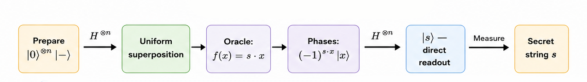
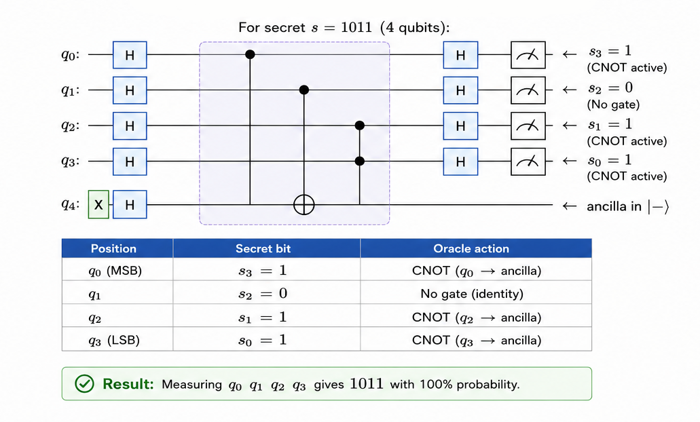

# Bernstein-Vazirani Algorithm

<div align="center">

**Recover a hidden n-bit string from a linear oracle using a single quantum query.**

`Proposed: 1993 (Bernstein & Vazirani) · Published: 1997 (SIAM Journal on Computing)`

</div>

---

## Table of Contents

- [Historical Background](#historical-background)
- [Problem Statement](#problem-statement)
- [Classical vs Quantum](#classical-vs-quantum)
- [How It Works — Intuition](#how-it-works--intuition)
- [Mathematical Formulation](#mathematical-formulation)
- [Step-by-Step Circuit Walkthrough](#step-by-step-circuit-walkthrough)
- [Complexity Analysis](#complexity-analysis)
- [Implementation Notes](#implementation-notes)
- [Applications](#applications)
- [Limitations & Caveats](#limitations--caveats)
- [Future Scope](#future-scope)
- [References](#references)

---

## Historical Background

**Ethan Bernstein and Umesh Vazirani** developed this algorithm in 1993 as part of their broader study of quantum complexity classes. Their seminal paper *"Quantum Complexity Theory"* (published in 1997) not only introduced this algorithm but also formalised the framework for comparing quantum and classical computational complexity.

The Bernstein-Vazirani algorithm is a natural extension of Deutsch-Jozsa. While Deutsch-Jozsa determines a *global property* of a function (constant vs balanced), Bernstein-Vazirani extracts *specific structural information* (the hidden string $s$). This shift from classification to information extraction was conceptually important — it showed that quantum algorithms could learn the *parameters* of a function, not just its type.

The algorithm also provided one of the first clear separations between quantum and classical *query* complexity: recovering $s$ classically requires $n$ queries (one per bit), but the quantum algorithm needs exactly one.

---

## Problem Statement

**Given**: A linear Boolean function implemented as a quantum oracle:
$$f(x) = s \cdot x \pmod{2} = s_1 x_1 \oplus s_2 x_2 \oplus \dots \oplus s_n x_n$$

where $s \in \{0,1\}^n$ is the unknown **hidden bit-string**.

**Goal**: Determine $s$ using as few oracle queries as possible.

**Classically**: Each query $f(e_i)$ reveals one bit $s_i$ (where $e_i$ is the $i$-th standard basis vector with a 1 in position $i$). This requires $n$ queries.

**Quantum**: The entire string $s$ is recovered in **one** query.

---

## Classical vs Quantum

| Approach | Queries | Strategy |
|---|:---:|---|
| Classical (optimal) | $n$ | Query $f(e_1), f(e_2), \dots, f(e_n)$ — each reveals one bit of $s$ |
| **Bernstein-Vazirani** | **1** | Superposition evaluates all inputs simultaneously; Hadamard decodes phases into $s$ |

This is a **linear speedup** ($n$ → 1), which is modest compared to the exponential speedups of Simon or Shor. However, the algorithm elegantly demonstrates the power of phase kickback and is foundational for understanding more complex algorithms.

---

## How It Works — Intuition




**Key insight**: The oracle writes the inner product $s \cdot x$ into the *phase* (not the amplitude) of each basis state. The Hadamard transform has a beautiful self-inverse property: it can both *encode* and *decode* inner-product phases. So applying Hadamard again *after* the oracle "unscrambles" the phases and leaves the quantum register in exactly the state $|s\rangle$.

---

## Mathematical Formulation

### Hadamard Transform Identity

The key mathematical identity is:

$$H^{\otimes n}|s\rangle = \frac{1}{\sqrt{2^n}}\sum_{x \in \{0,1\}^n}(-1)^{s \cdot x}|x\rangle$$

This means that the Hadamard transform maps the computational basis state $|s\rangle$ to a uniform superposition where each amplitude carries a phase determined by the inner product $s \cdot x$.

### Full Derivation

**Step 1**: Initial state
$$|0\rangle^{\otimes n}|1\rangle$$

**Step 2**: Apply $H^{\otimes (n+1)}$
$$\frac{1}{\sqrt{2^n}}\sum_{x}|x\rangle \otimes |-\rangle$$

**Step 3**: Oracle applies phase kickback
$$\frac{1}{\sqrt{2^n}}\sum_{x}(-1)^{f(x)}|x\rangle \otimes |-\rangle = \frac{1}{\sqrt{2^n}}\sum_{x}(-1)^{s \cdot x}|x\rangle \otimes |-\rangle$$

**Step 4**: Recognise this as $H^{\otimes n}|s\rangle \otimes |-\rangle$ (by the identity above)

**Step 5**: Apply $H^{\otimes n}$ to the input register:
$$H^{\otimes n}\left(H^{\otimes n}|s\rangle\right) = |s\rangle$$

Since $H^{\otimes n}$ is its own inverse: $(H^{\otimes n})^2 = I$.

**Step 6**: Measure → deterministically obtain $s$.

### Why It's Deterministic

The measurement outcome is $s$ with **probability 1** — there is zero uncertainty. This is because the state after step 5 is exactly $|s\rangle$, not a superposition. The Hadamard-Oracle-Hadamard sequence performs a perfect "Fourier decode" of the phase information.

---

## Step-by-Step Circuit Walkthrough



For secret $s = 1011$ (4 qubits):

| Position | Secret bit | Oracle action |
|:---:|:---:|---|
| q₀ (MSB) | $s_3 = 1$ | CNOT(q₀ → ancilla) |
| q₁ | $s_2 = 0$ | No gate (identity) |
| q₂ | $s_1 = 1$ | CNOT(q₂ → ancilla) |
| q₃ (LSB) | $s_0 = 1$ | CNOT(q₃ → ancilla) |

**Result**: Measuring q₀q₁q₂q₃ gives `1011` with 100% probability.

---

## Complexity Analysis

| Resource | Bernstein-Vazirani | Classical |
|---|:---:|:---:|
| Oracle queries | **1** | $n$ |
| Hadamard gates | $2n + 1$ | — |
| CNOT gates | $\|s\|$ (Hamming weight of $s$) | — |
| Total qubits | $n + 1$ | $n$ bits |
| Circuit depth | $O(n)$ | — |
| Success probability | **100%** | 100% |

---

## Implementation Notes

### Running the Code

```bash
pip install 'qiskit>=1.0' qiskit-aer
python implementation.py
```

### Test Cases

The implementation runs the algorithm on multiple secret strings:
- `"101"` (3-bit)
- `"1011"` (4-bit)
- `"110011"` (6-bit)
- `"11111"` (5-bit, all ones)
- `"10000001"` (8-bit, sparse)
- `"0000"` (4-bit, zero string)

### What the Output Shows

- Circuit diagram for each secret
- Measurement counts (should show 100% on the secret string)
- Automatic verification that the recovered string matches

---

## Applications

| Domain | Application |
|---|---|
| **Oracle model education** | Cleanest example of linear query speedup via quantum parallelism |
| **Phase kickback training** | The algorithm is the textbook illustration of the phase kickback technique |
| **Hidden linear function learning** | Generalises to learning hidden linear structures in Boolean functions |
| **Quantum fingerprinting** | Related techniques used in quantum communication complexity |
| **Benchmarking** | Used to validate quantum hardware — deterministic output makes errors easy to detect |
| **Quantum machine learning** | Subroutine in quantum algorithms for learning linear functions and parities |

---

## Limitations & Caveats

1. **Narrow oracle**: The function must be *exactly* a linear inner product $f(x) = s \cdot x \pmod{2}$. For non-linear functions, the algorithm gives meaningless results.

2. **Query speedup only**: The speedup is from $n$ queries to 1 query — significant but not exponential. The total gate count is still $O(n)$.

3. **Promise problem**: The function is *promised* to be linear. If this promise is violated, the algorithm has no guarantees.

4. **Noise vulnerability**: On real hardware, measurement errors can flip bits of the recovered string. Error mitigation or multiple shots with majority voting can help.

5. **Recursive extension**: Bernstein and Vazirani also showed a *recursive* version of the algorithm that achieves an exponential separation — but this is more complex and less commonly implemented.

---

## Future Scope

- **Recursive Bernstein-Vazirani**: The recursive version (depth-$d$ composition of oracles) provides an exponential separation: $O(1)$ quantum queries vs $\Omega(n^d)$ classical queries. This connects to deeper complexity-theoretic questions.

- **Noisy Learning**: Extending the algorithm to handle noisy oracles (where $f(x) = s \cdot x \oplus \text{noise}$) connects to the Learning Parity with Noise (LPN) problem — a foundation of post-quantum cryptography.

- **Quantum Machine Learning**: The phase-kickback + Hadamard-decode pattern appears in quantum algorithms for learning Boolean functions, including quantum PAC learning.

- **Generalised Hidden Linear Structure**: Extending from $\mathbb{F}_2$ (binary) to larger fields $\mathbb{F}_p$ — recovering hidden linear functions modulo arbitrary primes.

- **Hardware Benchmarking**: As quantum hardware improves, Bernstein-Vazirani on larger strings (10+, 50+, 100+ qubits) serves as a useful fidelity benchmark.

---

## References

1. **Bernstein, E., & Vazirani, U.** (1993). *Quantum Complexity Theory.* Proceedings of the 25th Annual ACM Symposium on Theory of Computing (STOC), 11–20. [DOI: 10.1145/167088.167097](https://doi.org/10.1145/167088.167097)
2. **Bernstein, E., & Vazirani, U.** (1997). *Quantum Complexity Theory.* SIAM Journal on Computing, 26(5), 1411–1473. [DOI: 10.1137/S0097539796300921](https://doi.org/10.1137/S0097539796300921)
3. **Cleve, R., Ekert, A., Macchiavello, C., & Mosca, M.** (1998). *Quantum algorithms revisited.* Proceedings of the Royal Society A, 454(1969), 339–354. [DOI: 10.1098/rspa.1998.0164](https://doi.org/10.1098/rspa.1998.0164)
4. **Nielsen, M. A., & Chuang, I. L.** (2010). *Quantum Computation and Quantum Information* (10th Anniversary Edition). [Cambridge University Press](https://doi.org/10.1017/CBO9780511976667). Section 1.4.4.
