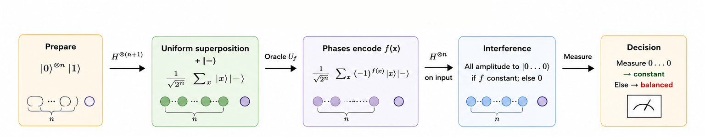
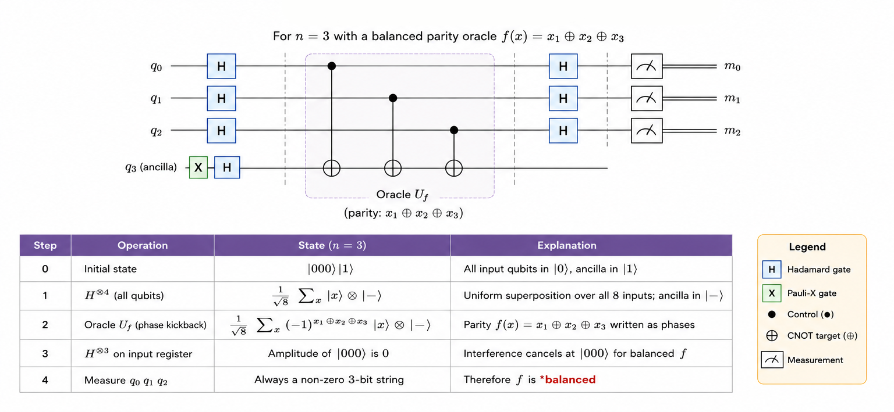

# Deutsch-Jozsa Algorithm

<div align="center">

**The first quantum algorithm to demonstrate an exponential deterministic advantage over classical computation.**

`Proposed: 1992 (Deutsch & Jozsa) · Simplified: 1998 (Cleve, Ekert, Macchiavello, Mosca)`

</div>

---

## Table of Contents

- [Historical Background](#historical-background)
- [Problem Statement](#problem-statement)
- [Classical vs Quantum](#classical-vs-quantum)
- [How It Works — Intuition](#how-it-works--intuition)
- [Mathematical Formulation](#mathematical-formulation)
- [Step-by-Step Circuit Walkthrough](#step-by-step-circuit-walkthrough)
- [Complexity Analysis](#complexity-analysis)
- [Implementation Notes](#implementation-notes)
- [Applications](#applications)
- [Limitations & Caveats](#limitations--caveats)
- [Future Scope](#future-scope)
- [References](#references)

---

## Historical Background

The story begins with **David Deutsch**, who in 1985 introduced the concept of a quantum Turing machine and posed a simple question: *can a quantum computer solve any problem faster than a classical one?* In 1992, **Deutsch and Richard Jozsa** provided the first affirmative answer with an algorithm that determines a global property of a Boolean function using exponentially fewer queries than any deterministic classical algorithm.

The original Deutsch-Jozsa algorithm was somewhat impractical in its circuit design. In 1998, **Cleve, Ekert, Macchiavello, and Mosca** reformulated it into the clean, elegant version taught today — using phase kickback as the key technique. This reformulation not only simplified the algorithm but also highlighted the deep connection between quantum interference and computational advantage.

Although the problem it solves is artificial (a "promise problem"), the Deutsch-Jozsa algorithm was historically pivotal. It established the **oracle model** as a framework for proving quantum speedups and directly inspired Bernstein-Vazirani, Simon, and ultimately Shor's groundbreaking factoring algorithm.

---

## Problem Statement

**Given**: A Boolean function $f: \{0,1\}^n \to \{0,1\}$ implemented as a quantum oracle, with the **promise** that $f$ is either:

- **Constant**: $f(x) = c$ for all $x$ (same output for every input), or
- **Balanced**: $f(x) = 0$ for exactly half the inputs and $f(x) = 1$ for the other half.

**Goal**: Determine whether $f$ is constant or balanced.

**No other functions are possible** — this is the "promise" that makes the problem well-defined.

---

## Classical vs Quantum

| Algorithm | Queries Required | Type |
|---|:---:|---|
| Deterministic classical (worst case) | $2^{n-1} + 1$ | Must check just over half the inputs |
| Randomised classical (high probability) | $O(1)$ | A few random samples suffice with high probability |
| **Deutsch-Jozsa (quantum)** | **1** | **Exact, deterministic** |

The quantum advantage is over *deterministic* classical algorithms. Randomised algorithms can solve this efficiently too — but Deutsch-Jozsa is *exact* (zero error probability) with a single query.

## How It Works — Intuition




The core idea is **constructive vs destructive interference**:

1. Create a uniform superposition over all possible inputs.
2. Query the oracle *once* — it evaluates $f$ on all inputs *simultaneously*.
3. Phase kickback writes $(-1)^{f(x)}$ onto each amplitude.
4. Apply Hadamards to the input register:
   - **Constant $f$**: all phases are the same sign → constructive interference at $|0\dots0\rangle$.
   - **Balanced $f$**: phases cancel exactly → destructive interference at $|0\dots0\rangle$.
5. Measure: if you see $|0\dots0\rangle$, the function is constant; otherwise, balanced.

---

## Mathematical Formulation

### Oracle Definition

The oracle acts as:
$$U_f|x\rangle|y\rangle = |x\rangle|y \oplus f(x)\rangle$$

### Phase Kickback

When the ancilla is in $|-\rangle = \frac{|0\rangle - |1\rangle}{\sqrt{2}}$:

$$
U_f|x\rangle|-\rangle = (-1)^{f(x)}|x\rangle|-\rangle
$$

The ancilla state is unchanged, but $f(x)$ appears as a *phase* on $|x\rangle$.

### Full State Evolution

**Step 1**: Initial state
$$|0\rangle^{\otimes n}|1\rangle$$

**Step 2**: After Hadamards on all qubits
$$\frac{1}{\sqrt{2^n}}\sum_{x=0}^{2^n - 1}|x\rangle \otimes |-\rangle$$

**Step 3**: After oracle (phase kickback)
$$\frac{1}{\sqrt{2^n}}\sum_{x=0}^{2^n - 1}(-1)^{f(x)}|x\rangle \otimes |-\rangle$$

**Step 4**: After Hadamards on input register, the amplitude of $|0\dots0\rangle$ is:
$$\alpha_{0\dots0} = \frac{1}{2^n}\sum_{x=0}^{2^n - 1}(-1)^{f(x)}$$

### Decision Rule

- **Constant $f$**: All terms have the same sign → $|\alpha_{0\dots0}| = 1$ → measure $|0\dots0\rangle$ with certainty.
- **Balanced $f$**: Exactly half are $+1$ and half are $-1$ → $\alpha_{0\dots0} = 0$ → $|0\dots0\rangle$ is *never* measured.

---

## Step-by-Step Circuit Walkthrough



For $n = 3$ with a balanced parity oracle $f(x) = x_1 \oplus x_2 \oplus x_3$:


| Step | State |
|---:|---|
| 0 | $\|000\rangle\|1\rangle$ |
| 1 | $\frac{1}{\sqrt{8}}\sum_{x}\|x\rangle \otimes \|-\rangle$ |
| 2 | $\frac{1}{\sqrt{8}}\sum_{x}(-1)^{x_1 \oplus x_2 \oplus x_3}\|x\rangle \otimes \|-\rangle$ |
| 3 | Hadamard decodes phases → amplitude of $\|000\rangle$ is 0 |
| 4 | Measure: always get a non-zero string → **balanced** |

---

## Complexity Analysis

| Resource | Deutsch-Jozsa | Classical (Deterministic) | Classical (Randomised) |
|---|:---:|:---:|:---:|
| Oracle queries | **1** | $2^{n-1}+1$ | $O(1)$ |
| Additional gates | $O(n)$ Hadamards | — | — |
| Success probability | **100%** | 100% | $1 - 2^{-k}$ for $k$ queries |
| Space | $n + 1$ qubits | $O(n)$ bits | $O(n)$ bits |

---

## Implementation Notes

### Running the Code

```bash
pip install 'qiskit>=1.0' qiskit-aer
python implementation.py
```

### Oracle Types Implemented

| Oracle | Type | Description |
|---|---|---|
| `constant_zero` | Constant | $f(x) = 0$ for all $x$ |
| `constant_one` | Constant | $f(x) = 1$ for all $x$ |
| `balanced_parity` | Balanced | $f(x) = x_1 \oplus x_2 \oplus \dots \oplus x_n$ |
| `balanced_inner_prod` | Balanced | $f(x) = x \cdot s \mod 2$ for a random mask $s$ |

### What the Output Shows

- Circuit diagram for each oracle type
- Measurement counts from simulation
- Automatic classification (constant vs balanced)
- Verification against expected result

---

## Applications

| Domain | Application |
|---|---|
| **Oracle separations** | First proof that quantum algorithms can be exponentially faster (in the deterministic query model) |
| **Phase kickback teaching** | The go-to pedagogical example of quantum interference in computation |
| **Algorithm design patterns** | Introduced the Hadamard-Oracle-Hadamard template used by Bernstein-Vazirani, Simon, and others |
| **Complexity theory** | Demonstrates the separation $\text{EQP} \neq \text{P}$ in the oracle model |
| **Quantum verification** | Used as a benchmark to verify correct operation of quantum hardware |

---

## Limitations & Caveats

1. **Promise problem**: The algorithm only works when the function is *guaranteed* to be either constant or balanced. A general function could be neither, and the algorithm gives no useful information about it.

2. **No practical advantage**: A randomised classical algorithm achieves the same practical result with $O(1)$ queries and high confidence. The quantum advantage is strictly about *deterministic* complexity.

3. **Oracle assumption**: The oracle is a black box — the algorithm says nothing about the circuit complexity of implementing $U_f$.

4. **Noise sensitivity**: On real quantum hardware, small errors can cause the all-zero state to be measured even for balanced functions (false positive), or non-zero states for constant functions (false negative).

---

## Future Scope

- **Generalised Deutsch-Jozsa**: Extending to functions with more than two possible output distributions (e.g., k-fold symmetric functions).

- **Noisy Oracles**: Analysing the algorithm's behaviour under depolarising, amplitude-damping, and correlated noise models — important for NISQ-era implementations.

- **Teaching Tool**: Deutsch-Jozsa remains the most accessible introduction to quantum algorithms and is central to every quantum computing curriculum.

- **Hybrid Classical-Quantum Protocols**: Using Deutsch-Jozsa-type interference as a subroutine in larger hybrid algorithms for property testing.

- **Quantum Software Verification**: Using the algorithm as a benchmark for quantum compilers, optimisers, and error mitigation techniques.

---

## References

1. **Deutsch, D., & Jozsa, R.** (1992). *Rapid Solution of Problems by Quantum Computation.* Proceedings of the Royal Society A, 439(1907), 553–558. [DOI: 10.1098/rspa.1992.0167](https://doi.org/10.1098/rspa.1992.0167)
2. **Cleve, R., Ekert, A., Macchiavello, C., & Mosca, M.** (1998). *Quantum algorithms revisited.* Proceedings of the Royal Society A, 454(1969), 339–354. [DOI: 10.1098/rspa.1998.0164](https://doi.org/10.1098/rspa.1998.0164)
3. **Deutsch, D.** (1985). *Quantum theory, the Church–Turing principle and the universal quantum computer.* Proceedings of the Royal Society A, 400(1818), 97–117. [DOI: 10.1098/rspa.1985.0070](https://doi.org/10.1098/rspa.1985.0070)
4. **Nielsen, M. A., & Chuang, I. L.** (2010). *Quantum Computation and Quantum Information* (10th Anniversary Edition). [Cambridge University Press](https://doi.org/10.1017/CBO9780511976667). Section 1.4.3.
