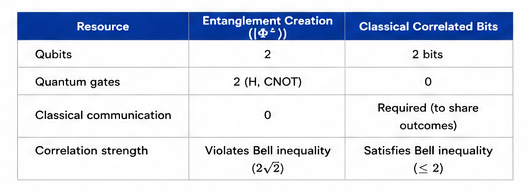
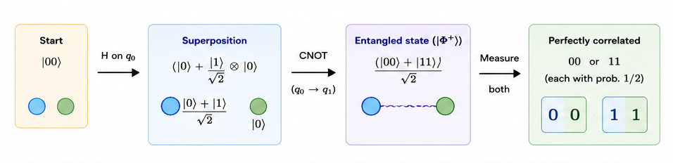
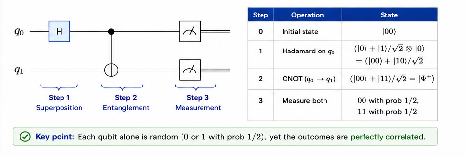
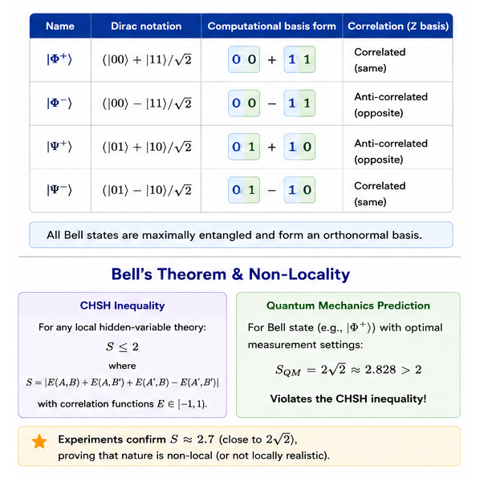

# Quantum Entanglement & Bell States

<div align="center">

**The foundational resource of quantum information — correlations that no classical system can replicate.**

`Proposed: 1935 (EPR) · Formalised: 1964 (Bell) · Demonstrated: 1972 (Freedman & Clauser)`

</div>

---

## Table of Contents

- [Historical Background](#historical-background)
- [Problem Statement](#problem-statement)
- [Classical vs Quantum](#classical-vs-quantum)
- [How It Works — Intuition](#how-it-works--intuition)
- [Mathematical Formulation](#mathematical-formulation)
- [Step-by-Step Circuit Walkthrough](#step-by-step-circuit-walkthrough)
- [The Four Bell States](#the-four-bell-states)
- [Bell's Theorem & Non-Locality](#bells-theorem--non-locality)
- [Complexity Analysis](#complexity-analysis)
- [Implementation Notes](#implementation-notes)
- [Applications](#applications)
- [Limitations & Caveats](#limitations--caveats)
- [Future Scope](#future-scope)
- [References](#references)

---

## Historical Background

Quantum entanglement was first identified as a paradox, not a feature. In their landmark 1935 paper, **Einstein, Podolsky, and Rosen (EPR)** argued that quantum mechanics must be *incomplete* because it predicted instantaneous correlations between distant particles — what Einstein famously called *"spooky action at a distance."*

The EPR argument assumed that any complete theory must be both **local** (no faster-than-light influences) and **realistic** (physical properties exist independently of measurement). Quantum mechanics violated one or both of these assumptions.

In 1964, **John Stewart Bell** derived a set of inequalities (Bell inequalities) that any local hidden-variable theory must satisfy. He showed that quantum mechanics *predicts violations* of these inequalities — meaning that if quantum mechanics is correct, nature itself must be non-local in some sense.

The first experimental test came in 1972 when **Freedman and Clauser** measured polarisation-entangled photon pairs and observed violations of Bell's inequality. The definitive "loophole-free" tests came in 2015 from groups in Delft, Vienna, and Boulder (NIST), earning **Aspect, Clauser, and Zeilinger** the **2022 Nobel Prize in Physics**.

---

## Problem Statement

**Goal**: Create a maximally entangled two-qubit state — a *Bell state* — where:

- Measuring either qubit individually yields a completely random result (50/50).
- The two measurement outcomes are *perfectly correlated* (or anti-correlated), despite the randomness of each individual result.
- These correlations are stronger than anything achievable by shared classical randomness.

---

## Classical vs Quantum



| Property | Classical (shared coin flips) | Quantum (Bell state) |
|---|---|---|
| Individual randomness | ✓ Can be random | ✓ Always perfectly random |
| Perfect correlation | ✓ Pre-agreed outcomes | ✓ Measurement correlations |
| Basis independence | ✗ Fixed basis only | ✓ Correlated in *any* basis |
| Bell inequality | Satisfies CHSH ≤ 2 | Violates: CHSH = 2√2 |
| No-cloning | ✗ Bits can be copied | ✓ Entanglement cannot be cloned |

The key quantum advantage is **basis independence**: entangled particles show correlations *regardless of which measurement basis* the experimenters choose — even if they choose their bases at the last instant.

---

## How It Works — Intuition




1. **Start** with two qubits in $|00\rangle$.
2. **Hadamard** the first qubit: creates a superposition $\frac{|0\rangle + |1\rangle}{\sqrt{2}} \otimes |0\rangle$.
3. **CNOT** from the first qubit to the second: if the first is $|1\rangle$, flip the second.
4. **Result**: The state $\frac{|00\rangle + |11\rangle}{\sqrt{2}}$ — the qubits are entangled.

The CNOT gate "spreads" the superposition: both qubits are now in an indefinite state, but they are *correlated*. You cannot describe the state of either qubit independently.

---

## Mathematical Formulation

### Bell State Construction

Starting from $|00\rangle$:

$$\left|\psi_0\right\rangle = |00\rangle$$

Applying Hadamard to the first qubit ($q_0$):

$$\left|\psi_1\right\rangle = (H \otimes I)|00\rangle = \left(\frac{|0\rangle + |1\rangle}{\sqrt{2}}\right)|0\rangle = \frac{|00\rangle + |10\rangle}{\sqrt{2}}$$

Applying CNOT (control $q_0$, target $q_1$):

$$\left|\psi_2\right\rangle = \text{CNOT}\left(\frac{|00\rangle + |10\rangle}{\sqrt{2}}\right) = \frac{\text{CNOT}|00\rangle + \text{CNOT}|10\rangle}{\sqrt{2}} = \frac{|00\rangle + |11\rangle}{\sqrt{2}}$$

This state cannot be written as a product of single-qubit states:

$$\frac{|00\rangle + |11\rangle}{\sqrt{2}} \neq |a\rangle \otimes |b\rangle$$

This is the definition of **quantum entanglement**.

### Density Matrix

The density matrix of the Bell state $|\Phi^+\rangle$ is:

$$
\rho_{AB} = |\Phi^+\rangle\langle\Phi^+| = \frac{1}{2}\begin{pmatrix} 1 & 0 & 0 & 1 \\ 0 & 0 & 0 & 0 \\ 0 & 0 & 0 & 0 \\ 1 & 0 & 0 & 1 \end{pmatrix}
$$

### Reduced States (Partial Trace)

Tracing out either qubit gives the maximally mixed state:

$$
\rho_A = \text{Tr}_B(\rho_{AB}) = \frac{I}{2} = \frac{1}{2}\begin{pmatrix} 1 & 0 \\ 0 & 1 \end{pmatrix}
$$

This means each qubit *individually* is completely random, yet *jointly* they are perfectly correlated.

### Non-Separability Proof

A state $|\psi\rangle_{AB}$ is **separable** if it can be written as $|\alpha\rangle_A \otimes |\beta\rangle_B$. For $|\Phi^+\rangle$:

$$
(a|0\rangle + b|1\rangle) \otimes (c|0\rangle + d|1\rangle) = ac|00\rangle + ad|01\rangle + bc|10\rangle + bd|11\rangle
$$

Matching with $|\Phi^+\rangle$ requires $ac = bd = \frac{1}{\sqrt{2}}$ and $ad = bc = 0$. But $ad = 0$ implies $a = 0$ or $d = 0$, contradicting $ac \neq 0$ and $bd \neq 0$. **Therefore $|\Phi^+\rangle$ is not separable — it is entangled.**

---

## Step-by-Step Circuit Walkthrough




| Step | Operation | State |
|---:|---|---|
| 0 | Initial state | $\|00\rangle$ |
| 1 | Hadamard on q₀ | $\frac{\|0\rangle + \|1\rangle}{\sqrt{2}} \otimes \|0\rangle$ |
| 2 | CNOT (q₀ → q₁) | $\frac{\|00\rangle + \|11\rangle}{\sqrt{2}}$ |
| 3 | Measure both | `00` with prob 1/2, `11` with prob 1/2 |

---

## The Four Bell States

All four Bell states form an orthonormal basis for the 2-qubit Hilbert space:

| Bell State | Symbol | Expression | Circuit Modification |
|---|:---:|---|---|
| Φ⁺ | $\|\Phi^+\rangle$ | $\frac{\|00\rangle + \|11\rangle}{\sqrt{2}}$ | H + CNOT |
| Φ⁻ | $\|\Phi^-\rangle$ | $\frac{\|00\rangle - \|11\rangle}{\sqrt{2}}$ | H + CNOT + Z on q₀ |
| Ψ⁺ | $\|\Psi^+\rangle$ | $\frac{\|01\rangle + \|10\rangle}{\sqrt{2}}$ | H + CNOT + X on q₁ |
| Ψ⁻ | $\|\Psi^-\rangle$ | $\frac{\|01\rangle - \|10\rangle}{\sqrt{2}}$ | H + CNOT + X on q₁ + Z on q₀ |

**Correlations:**
- $|\Phi^\pm\rangle$: both qubits always agree (outcomes `00` or `11`)
- $|\Psi^\pm\rangle$: both qubits always disagree (outcomes `01` or `10`)

---

## Bell's Theorem & Non-Locality



The **CHSH inequality** (a specific form of Bell's inequality) states that for any local hidden-variable theory:

$$
|E(a,b) - E(a,b') + E(a',b) + E(a',b')| \leq 2
$$

where $E(a,b)$ is the expectation value of the product of outcomes when Alice measures along direction $a$ and Bob measures along $b$.

**Quantum mechanics predicts** a maximum violation of:

$$
\text{CHSH} = 2\sqrt{2} \approx 2.828
$$

achieved by the Bell state $|\Phi^+\rangle$ with optimally chosen measurement angles. This violation has been confirmed experimentally to extraordinary precision.

---

## Complexity Analysis

| Resource | Cost |
|---|---|
| Qubits | 2 |
| Gates | 2 (one H, one CNOT) |
| Circuit depth | 2 |
| Classical bits | 2 (for measurement) |
| Entanglement (ebits) | 1 |

Bell-state preparation is one of the simplest quantum operations, but it is also one of the most consequential.

---

## Implementation Notes

### Running the Code

```bash
pip install 'qiskit>=1.0' qiskit-aer
python implementation.py
```

### What the Output Shows

1. **Circuit diagrams** for all four Bell states
2. **Exact statevectors** confirming the mathematical expressions
3. **Measurement counts** from 8,192 shots showing perfect correlations
4. **Correlation verification** confirming each Bell state produces only the expected outcome pairs

---

## Applications

| Domain | Use Case |
|---|---|
| **Quantum Teleportation** | Bell pairs are the "quantum channel" for state transfer |
| **Superdense Coding** | Send 2 classical bits using 1 qubit + 1 shared ebit |
| **Quantum Key Distribution** | E91 protocol uses Bell-state correlations for secure key generation |
| **Quantum Error Correction** | Stabiliser codes use entanglement to protect quantum information |
| **Quantum Networks** | Entanglement distribution enables quantum internet |
| **Quantum Computing** | CNOT gates in circuits create and consume entanglement |
| **Fundamental Physics** | Tests of Bell inequalities probe the nature of reality |
| **Quantum Sensing** | Entangled states achieve Heisenberg-limited measurement precision |

---

## Limitations & Caveats

1. **Decoherence**: Entanglement is extremely fragile — interactions with the environment destroy it (decoherence times range from microseconds to seconds depending on hardware).

2. **No FTL communication**: Entanglement *cannot* transmit information faster than light. The correlations only become apparent when measurement results are *compared* via a classical channel.

3. **No cloning**: Entangled states cannot be copied (no-cloning theorem). Each Bell pair is consumed upon use.

4. **Distribution challenge**: Distributing entangled particles over long distances (e.g., via optical fibre) suffers from photon loss and requires quantum repeaters.

5. **Monogamy**: Entanglement is monogamous — a qubit maximally entangled with one partner *cannot* be entangled with any other system.

---

## Future Scope

- **Quantum Internet**: Entanglement distribution over continental distances using satellite links (demonstrated by China's Micius satellite in 2017) and quantum repeater networks.

- **Entanglement-Enhanced Sensing**: Gravitational wave detectors (LIGO), atomic clocks, and magnetometers using squeezed and entangled states for sub-shot-noise precision.

- **Topological Entanglement**: Using long-range entanglement patterns in topological quantum error-correcting codes (e.g., surface codes, toric codes) for fault-tolerant quantum computing.

- **Multipartite Entanglement**: Generating and characterising GHZ states, W states, and cluster states for measurement-based quantum computing.

- **Entanglement in Many-Body Physics**: Understanding entanglement entropy, area laws, and entanglement transitions in condensed matter systems.

- **Loophole-Free Bell Tests**: Continued refinement of Bell tests with improved detector efficiency and space-like separation to close all remaining loopholes.

---

## References

1. **Einstein, A., Podolsky, B., & Rosen, N.** (1935). *Can Quantum-Mechanical Description of Physical Reality Be Considered Complete?* Physical Review, 47(10), 777–780. [DOI: 10.1103/PhysRev.47.777](https://doi.org/10.1103/PhysRev.47.777)
2. **Bell, J. S.** (1964). *On the Einstein Podolsky Rosen Paradox.* Physics Physique Физика, 1(3), 195–200. [DOI: 10.1103/PhysicsPhysiqueFizika.1.195](https://doi.org/10.1103/PhysicsPhysiqueFizika.1.195)
3. **Aspect, A., Grangier, P., & Roger, G.** (1982). *Experimental Realization of Einstein-Podolsky-Rosen-Bohm Gedankenexperiment: A New Violation of Bell's Inequalities.* Physical Review Letters, 49(2), 91–94. [DOI: 10.1103/PhysRevLett.49.91](https://doi.org/10.1103/PhysRevLett.49.91)
4. **Clauser, J. F., Horne, M. A., Shimony, A., & Holt, R. A.** (1969). *Proposed Experiment to Test Local Hidden-Variable Theories.* Physical Review Letters, 23(15), 880–884. [DOI: 10.1103/PhysRevLett.23.880](https://doi.org/10.1103/PhysRevLett.23.880)
5. **Hensen, B., et al.** (2015). *Loophole-free Bell inequality violation using electron spins separated by 1.3 kilometres.* Nature, 526, 682–686. [DOI: 10.1038/nature15759](https://doi.org/10.1038/nature15759)
6. **Nielsen, M. A., & Chuang, I. L.** (2010). *Quantum Computation and Quantum Information* (10th Anniversary Edition). [Cambridge University Press](https://doi.org/10.1017/CBO9780511976667). Chapters 1–2.
