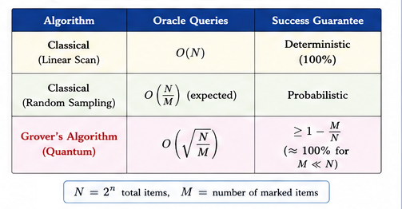
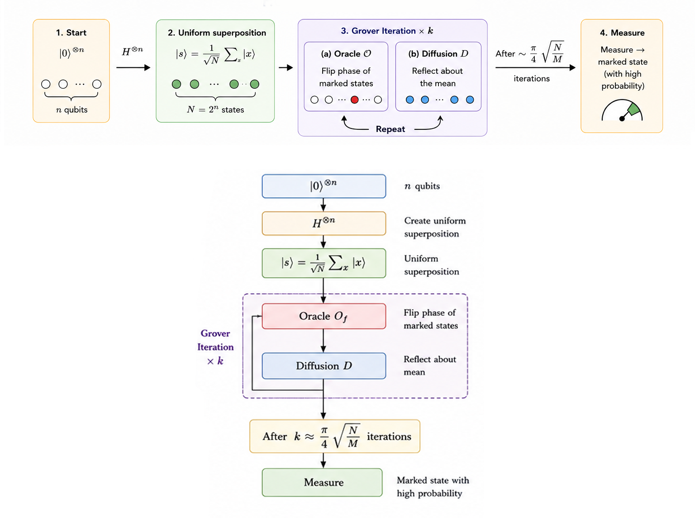
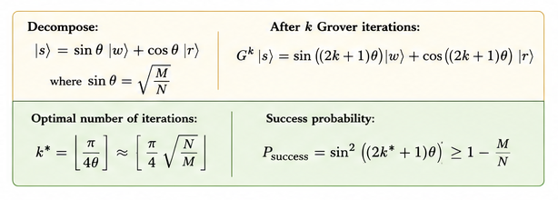
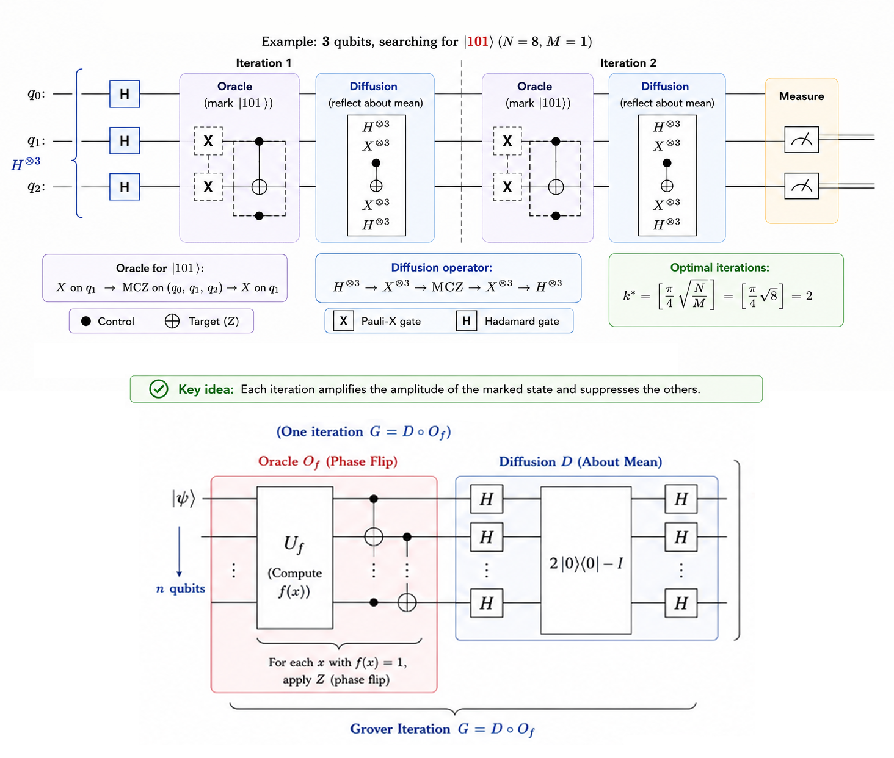
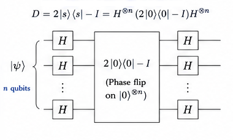
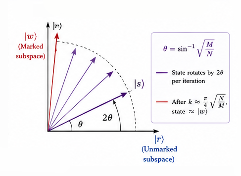
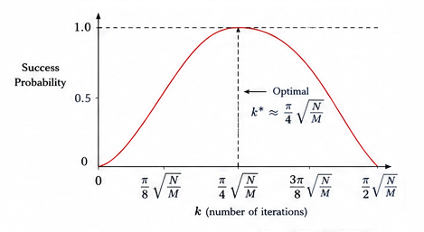
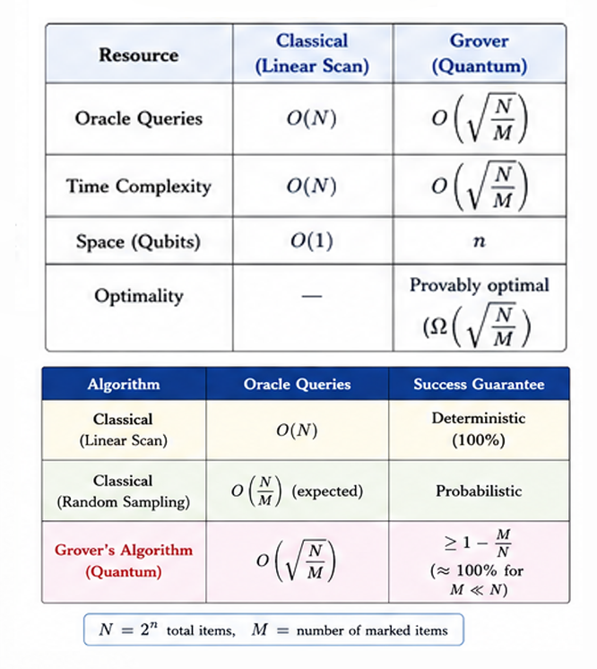

# Grover's Search Algorithm

<div align="center">

**Quadratic quantum speedup for unstructured search — provably optimal.**

`Proposed: 1996 (Lov Grover) · Optimality Proven: 1997 (Bennett, Bernstein, Brassard, Vazirani)`

</div>

---

## Table of Contents

- [Historical Background](#historical-background)
- [Problem Statement](#problem-statement)
- [Classical vs Quantum](#classical-vs-quantum)
- [How It Works — Intuition](#how-it-works--intuition)
- [Mathematical Formulation](#mathematical-formulation)
- [Step-by-Step Circuit Walkthrough](#step-by-step-circuit-walkthrough)
- [Geometric Interpretation](#geometric-interpretation)
- [Complexity Analysis](#complexity-analysis)
- [Implementation Notes](#implementation-notes)
- [Applications](#applications)
- [Limitations & Caveats](#limitations--caveats)
- [Future Scope](#future-scope)
- [References](#references)

---

## Historical Background

In 1996, **Lov K. Grover**, working at Bell Labs, published an algorithm that searches an unstructured database of $N$ items in $O(\sqrt{N})$ time — a quadratic improvement over the $O(N)$ classical brute-force search. The algorithm was presented at STOC 1996 and quickly became one of the most celebrated results in quantum computing.

Unlike Shor's algorithm (which provides an exponential speedup for a specific structured problem), Grover's algorithm provides a **quadratic speedup for any search problem** — making it arguably the most broadly applicable quantum algorithm. Any computational problem that can be framed as "search for an input satisfying a condition" benefits from Grover's approach.

In 1997, **Bennett, Bernstein, Brassard, and Vazirani** proved that $\Omega(\sqrt{N})$ queries are necessary for *any* quantum algorithm solving unstructured search — proving Grover's algorithm is **optimal**. This was one of the first quantum lower bounds and established that quantum computers cannot solve NP-complete problems in polynomial time via brute-force alone.

The underlying mechanism — **amplitude amplification** — was later generalised by **Brassard, Høyer, Mosca, and Tapp** (2002) into a powerful algorithmic primitive applicable far beyond simple search.

---

## Problem Statement

**Given**: A Boolean oracle $f: \{0,1\}^n \to \{0,1\}$ that marks exactly $M$ out of $N = 2^n$ items:

$$f(x) = \begin{cases} 1 & \text{if } x \text{ is a solution (marked)} \\ 0 & \text{otherwise} \end{cases}$$

**Goal**: Find any marked item $x^*$ with $f(x^*) = 1$ using as few oracle queries as possible.

---

## Classical vs Quantum



| Algorithm | Oracle Queries | Success Guarantee |
|---|:---:|---|
| Classical (linear scan) | $O(N)$ worst case | Deterministic |
| Classical (random sampling) | $O(N/M)$ expected | Probabilistic |
| **Grover's algorithm** | $O\!\left(\sqrt{N/M}\right)$ | Probability ≈ 1 |

For a single marked item ($M = 1$):
- Classical: $O(N)$ = $O(2^n)$ queries
- Grover: $O(\sqrt{N})$ = $O(2^{n/2})$ queries

---

## How It Works — Intuition




**Analogy — The Quantum Spotlight:**

Imagine a dark room with $N$ identical boxes and one marked box. Classically, you check boxes one by one. Quantum mechanically:

1. **Start**: Shine a dim, uniform light on all boxes equally.
2. **Oracle**: The marked box absorbs the light (phase flip — its "brightness" becomes negative).
3. **Diffusion**: A mirror reflects all brightnesses about their average. Because the marked box has negative brightness, the reflection *increases* its brightness while *decreasing* everyone else's.
4. **Repeat**: After $\sim \frac{\pi}{4}\sqrt{N}$ repetitions, almost all the light is concentrated on the marked box.
5. **Measure**: You see the marked box with near-certainty.

---

## Mathematical Formulation



### State Space Decomposition

Define:
- $|w\rangle$ = normalised superposition of marked states
- $|r\rangle$ = normalised superposition of unmarked states
- $|s\rangle = H^{\otimes n}|0\rangle = \frac{1}{\sqrt{N}}\sum_x|x\rangle$ = uniform superposition

Then:
$$|s\rangle = \sin\theta \cdot |w\rangle + \cos\theta \cdot |r\rangle$$

where $\sin\theta = \sqrt{M/N}$.

### Oracle Operator

$$O = I - 2|w\rangle\langle w|$$

This flips the sign of marked states: $O|x\rangle = (-1)^{f(x)}|x\rangle$.

### Diffusion Operator

$$D = 2|s\rangle\langle s| - I = H^{\otimes n}(2|0\rangle\langle 0| - I)H^{\otimes n}$$

This reflects all amplitudes about the mean amplitude.

### Grover Iteration

The **Grover iterate** $G = D \cdot O$ is a rotation by $2\theta$ in the 2D plane spanned by $\{|w\rangle, |r\rangle\}$:

$$G^k|s\rangle = \sin\!\big((2k+1)\theta\big)|w\rangle + \cos\!\big((2k+1)\theta\big)|r\rangle$$

### Optimal Number of Iterations

To maximise $\sin^2((2k+1)\theta)$, choose:

$$k^* = \left\lfloor \frac{\pi}{4\theta} \right\rfloor \approx \left\lfloor \frac{\pi}{4}\sqrt{\frac{N}{M}} \right\rfloor$$

At this point, the probability of measuring a marked state is:

$$P(\text{success}) = \sin^2\!\big((2k^*+1)\theta\big) \geq 1 - \frac{M}{N}$$

### Why It Works: Two Reflections = Rotation

Each Grover iteration consists of two reflections:
1. $O$ reflects about the hyperplane orthogonal to $|w\rangle$
2. $D$ reflects about the hyperplane orthogonal to $|s\rangle$

By the theory of geometric reflections, two reflections whose axes differ by angle $\theta$ compose into a rotation by $2\theta$. This is why the state rotates toward $|w\rangle$ at a rate of $2\theta$ per iteration.

---

## Step-by-Step Circuit Walkthrough



For 3 qubits, searching for $|101\rangle$:


**Oracle for $|101\rangle$**: X on q₁ → MCZ on (q₀, q₁, q₂) → X on q₁

**Diffusion Operator**:



$$D = H^{\otimes n} (2|0\rangle\langle0| - I) H^{\otimes n}$$

In our implementation: H⊗³ → X⊗³ → MCZ → X⊗³ → H⊗³

Optimal iterations for $N = 8$, $M = 1$: $k^* = \lfloor\frac{\pi}{4}\sqrt{8}\rfloor = 2$

---

## Geometric Interpretation

The entire algorithm operates in a **2-dimensional plane** within the $2^n$-dimensional Hilbert space:




Starting at angle $\theta$ from the unmarked axis, each iteration rotates by $2\theta$ toward the marked axis. After $\sim \frac{\pi}{4\theta}$ iterations, the state is nearly aligned with $|w\rangle$.

**Warning**: Overshooting is possible! Performing *more* than the optimal number of iterations rotates *past* $|w\rangle$ and the success probability *decreases*.



---

## Complexity Analysis



| Resource | Grover | Classical |
|---|:---:|:---:|
| Oracle queries | $O(\sqrt{N/M})$ | $O(N/M)$ |
| Qubits | $n + O(\text{oracle ancilla})$ | $O(n)$ bits |
| Gate depth | $O(\sqrt{N} \cdot n)$ | — |
| Success probability | $\geq 1 - M/N$ | 1 (deterministic) |
| Optimality | **Proven optimal** | Proven optimal |

**Lower bound**: Any quantum algorithm must make $\Omega(\sqrt{N/M})$ queries — Grover's is optimal.

---

## Implementation Notes

### Running the Code

```bash
pip install 'qiskit>=1.0' qiskit-aer
python implementation.py
```

### Features

- **General n-qubit** implementation (not hardcoded to any specific state)
- **Configurable marked states** — works with single or multiple targets
- **Multi-controlled-Z** oracle using MCX decomposition
- **Automatic optimal iteration count** calculation
- **Amplitude evolution tracking** showing probability growth across iterations

### Test Cases

| Configuration | N | M | Optimal Iterations |
|---|---:|---:|---:|
| 2 qubits, $\|11\rangle$ | 4 | 1 | 1 |
| 3 qubits, $\|101\rangle$ | 8 | 1 | 2 |
| 3 qubits, $\|010\rangle + \|110\rangle$ | 8 | 2 | 1 |
| 4 qubits, $\|1010\rangle$ | 16 | 1 | 3 |

---

## Applications

| Domain | Application |
|---|---|
| **Database search** | Searching an unsorted database of $N$ records in $O(\sqrt{N})$ |
| **Satisfiability (SAT)** | Quadratic speedup for brute-force SAT solving |
| **Cryptographic key search** | Halves the effective security of symmetric keys (AES-128 → 64-bit security) |
| **Amplitude amplification** | General framework: amplify success probability of any quantum subroutine |
| **Quantum walks** | Connection to quantum-walk-based search on graphs |
| **Combinatorial optimisation** | Grover-type acceleration for branch-and-bound, constraint satisfaction |
| **Quantum machine learning** | Quadratic speedup for nearest-neighbour search, minimum finding |

---

## Limitations & Caveats

1. **Quadratic, not exponential**: The $\sqrt{N}$ speedup is significant but modest. It does *not* make NP-complete problems tractable.

2. **Oracle overhead**: The oracle $O$ must be implemented efficiently as a quantum circuit. For some problems, constructing $O$ is itself expensive.

3. **Known number of solutions**: The optimal iteration count requires knowing $M$. If $M$ is unknown, **quantum counting** or exponential search strategies are needed.

4. **Overshooting**: Too many iterations *decrease* success probability. The algorithm must be carefully tuned.

5. **NISQ limitations**: Deep circuits with many Grover iterations accumulate noise rapidly. On current hardware, only small-scale demonstrations (≤ 5 qubits) are feasible.

6. **No speedup for structured search**: If the search space has exploitable structure (e.g., sorted data), classical algorithms can be faster than $O(N)$ — and Grover's quadratic improvement over brute-force may not help.

---

## Future Scope

- **Amplitude Amplification**: The generalised framework applies to any quantum subroutine with bounded success probability — boosting it to near-certainty with $O(1/\sqrt{p})$ repetitions.

- **Quantum Minimum Finding**: Dürr and Høyer (1996) showed that the minimum of $N$ elements can be found in $O(\sqrt{N})$ quantum queries using Grover-based techniques.

- **Quantum Cryptanalysis**: Grover's algorithm effectively halves symmetric key lengths. This drives the migration to 256-bit keys (AES-256) for post-quantum security.

- **Variational Quantum Eigensolver (VQE)**: Grover-type amplitude amplification can accelerate state preparation in variational quantum algorithms.

- **Quantum-Enhanced Optimisation**: Combining Grover search with branch-and-bound pruning for NP-hard optimisation problems (e.g., travelling salesman, maximum satisfiability).

- **Quantum Machine Learning**: Grover search as a subroutine for quantum k-nearest neighbours, quantum recommendation systems, and quantum cluster finding.

- **Fault-Tolerant Implementation**: Implementing large-scale Grover search on fault-tolerant quantum computers with error-corrected logical qubits — the next major milestone.

---

## References

1. **Grover, L. K.** (1996). *A Fast Quantum Mechanical Algorithm for Database Search.* Proceedings of the 28th Annual ACM Symposium on Theory of Computing (STOC), 212–219. [DOI: 10.1145/237814.237866](https://doi.org/10.1145/237814.237866)
2. **Grover, L. K.** (1997). *Quantum Mechanics Helps in Searching for a Needle in a Haystack.* Physical Review Letters, 79(2), 325–328. [DOI: 10.1103/PhysRevLett.79.325](https://doi.org/10.1103/PhysRevLett.79.325)
3. **Bennett, C. H., Bernstein, E., Brassard, G., & Vazirani, U.** (1997). *Strengths and Weaknesses of Quantum Computing.* SIAM Journal on Computing, 26(5), 1510–1523. [DOI: 10.1137/S0097539796300933](https://doi.org/10.1137/S0097539796300933)
4. **Brassard, G., Høyer, P., Mosca, M., & Tapp, A.** (2002). *Quantum Amplitude Amplification and Estimation.* Contemporary Mathematics, 305, 53–74. [DOI: 10.1090/conm/305/05215](https://doi.org/10.1090/conm/305/05215)
5. **Boyer, M., Brassard, G., Høyer, P., & Tapp, A.** (1998). *Tight Bounds on Quantum Searching.* Fortschritte der Physik, 46(4–5), 493–505. [DOI: 10.1002/(SICI)1521-3978(199806)46:4/5&lt;493::AID-PROP493&gt;3.0.CO;2-P](https://doi.org/10.1002/(SICI)1521-3978(199806)46:4/5%3C493::AID-PROP493%3E3.0.CO;2-P) (Preprint: [arXiv:quant-ph/9605034](https://arxiv.org/abs/quant-ph/9605034))
6. **Nielsen, M. A., & Chuang, I. L.** (2010). *Quantum Computation and Quantum Information* (10th Anniversary Edition). [Cambridge University Press](https://doi.org/10.1017/CBO9780511976667). Section 6.1.
