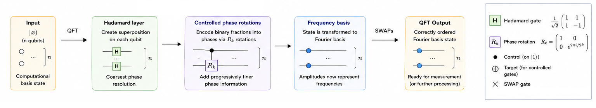
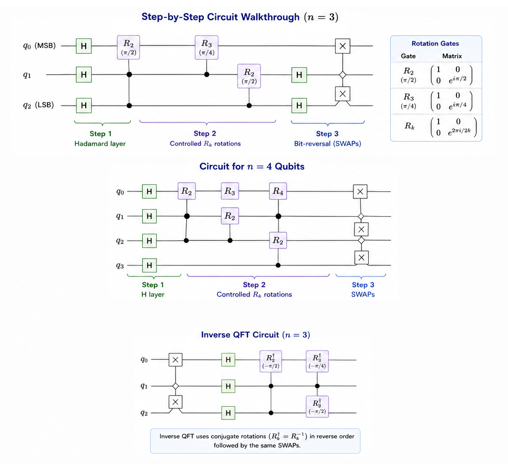
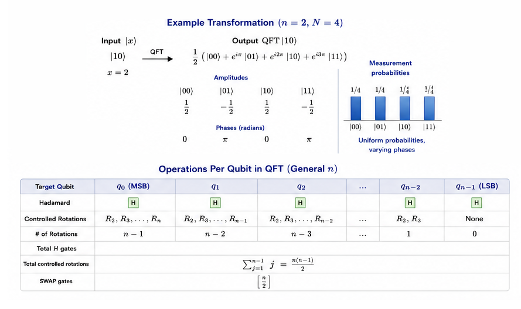

# Quantum Fourier Transform (QFT)

<div align="center">

**The quantum analogue of the Discrete Fourier Transform — exponentially faster and the engine behind Shor's algorithm.**

`Core Subroutine · First Used: 1994 (Shor) · Gate Count: O(n²)`

</div>

---

## Table of Contents

- [Historical Background](#historical-background)
- [Problem Statement](#problem-statement)
- [Classical vs Quantum](#classical-vs-quantum)
- [How It Works — Intuition](#how-it-works--intuition)
- [Mathematical Formulation](#mathematical-formulation)
- [Step-by-Step Circuit Walkthrough](#step-by-step-circuit-walkthrough)
- [Product Representation](#product-representation)
- [Complexity Analysis](#complexity-analysis)
- [Implementation Notes](#implementation-notes)
- [Applications](#applications)
- [Limitations & Caveats](#limitations--caveats)
- [Future Scope](#future-scope)
- [References](#references)

---

## Historical Background

The Fourier transform has been central to mathematics, physics, and engineering since Joseph Fourier's work in the early 19th century. Its discrete version (DFT) and the efficient **Fast Fourier Transform (FFT)** algorithm (Cooley & Tukey, 1965) revolutionised signal processing, reducing the DFT from $O(N^2)$ to $O(N \log N)$ operations.

The **Quantum Fourier Transform** takes this a step further. It was first implicitly used by **Peter Shor** in his 1994 factoring algorithm, where it serves as the phase-readout mechanism in quantum phase estimation. The QFT performs the same mathematical transformation as the DFT, but on *quantum amplitudes* rather than classical data — and it does so using only $O(n^2)$ gates for $N = 2^n$ points, compared to $O(N \log N) = O(n \cdot 2^n)$ for the classical FFT.

However, there is a crucial caveat: the QFT does not provide direct access to the Fourier coefficients (measuring collapses the state). Its power lies in transforming hidden periodicity in amplitudes into measurable phase information — exactly what algorithms like Shor's need.

---

## Problem Statement

**Given**: A quantum state $|x\rangle$ in the computational basis, where $x \in \{0, 1, \dots, N-1\}$ and $N = 2^n$.

**Goal**: Transform the state into the Fourier basis:

$$\text{QFT}|x\rangle = \frac{1}{\sqrt{N}}\sum_{y=0}^{N-1} e^{2\pi i x y / N}|y\rangle$$

The QFT maps periodicity in amplitudes into peaks in the frequency basis, making hidden periods measurable.

---

## Classical vs Quantum

| Property | Classical FFT | Quantum Fourier Transform |
|---|:---:|:---:|
| Input size | $N$ complex numbers | $n = \log_2 N$ qubits |
| Operations | $O(N \log N)$ | $O(n^2) = O(\log^2 N)$ |
| Output | $N$ complex numbers (readable) | $n$-qubit state (not directly readable) |
| Speedup | — | **Exponential** in gate count |
| Direct readout? | ✓ Yes | ✗ No (measurement collapses) |
| Inverse | $O(N \log N)$ | $O(n^2)$ (adjoint circuit) |

The QFT is exponentially faster in gate count, but the output is a quantum state — not a classical Fourier vector. This limits direct applications but is perfect for algorithms that process phases internally (phase estimation, order finding).

---

## How It Works — Intuition




**Key insight**: The QFT can be decomposed into a product of single-qubit operations, each encoding one bit of the input into the *phase* of a qubit. This product structure allows the entire $2^n$-dimensional transform to be performed with just $n$ qubits and $O(n^2)$ gates.

Think of it as: each qubit in the output encodes a different "frequency resolution" of the input — the most significant qubit captures the coarsest periodicity, and the least significant captures the finest.

---

## Mathematical Formulation

### Definition

For $N = 2^n$, the QFT maps computational basis states as:

$$\text{QFT}|x\rangle = \frac{1}{\sqrt{N}}\sum_{y=0}^{N-1} \omega^{xy} |y\rangle$$

where $\omega = e^{2\pi i / N}$ is the primitive $N$-th root of unity.

### As a Unitary Matrix

$$U_{\text{QFT}} = \frac{1}{\sqrt{N}} \begin{pmatrix} 1 & 1 & 1 & \cdots & 1 \\ 1 & \omega & \omega^2 & \cdots & \omega^{N-1} \\ 1 & \omega^2 & \omega^4 & \cdots & \omega^{2(N-1)} \\ \vdots & \vdots & \vdots & \ddots & \vdots \\ 1 & \omega^{N-1} & \omega^{2(N-1)} & \cdots & \omega^{(N-1)^2} \end{pmatrix}$$

This is identical to the DFT matrix — the QFT simply implements it as a quantum circuit.

### Inverse QFT

$$\text{QFT}^{-1}|y\rangle = \frac{1}{\sqrt{N}}\sum_{x=0}^{N-1} \omega^{-xy} |x\rangle$$

The inverse QFT is obtained by conjugating all rotation angles (i.e., reversing the circuit and negating phases).

---

## Step-by-Step Circuit Walkthrough



For $n = 3$ qubits:


### Gate Decomposition

For each target qubit $j$ (from 0 to $n-1$):

1. **Hadamard** on qubit $j$: creates the superposition $\frac{|0\rangle + e^{2\pi i \cdot 0.x_j}|1\rangle}{\sqrt{2}}$

2. **Controlled-$R_k$ rotations** from qubits $j+1, j+2, \dots, n-1$:
$$R_k = \begin{pmatrix} 1 & 0 \\ 0 & e^{2\pi i / 2^k} \end{pmatrix}$$

   Each controlled rotation adds finer phase information from lower qubits.

3. **Final SWAP**: Reverse qubit order to match standard Fourier convention.

| Gate | Matrix | Phase Added |
|---|---|---|
| $H$ | $\frac{1}{\sqrt{2}}\begin{pmatrix}1&1\\1&-1\end{pmatrix}$ | $\pi$ (coarsest) |
| $R_2$ | $\text{diag}(1, e^{i\pi/2})$ | $\pi/2$ |
| $R_3$ | $\text{diag}(1, e^{i\pi/4})$ | $\pi/4$ |
| $R_k$ | $\text{diag}(1, e^{2\pi i/2^k})$ | $2\pi/2^k$ (finest) |

---

## Product Representation

The QFT output can be written as a tensor product:

$$\text{QFT}|x_1 x_2 \dots x_n\rangle = \frac{1}{\sqrt{2^n}} \bigotimes_{k=1}^{n} \left( |0\rangle + e^{2\pi i \cdot 0.x_k x_{k+1} \dots x_n} |1\rangle \right)$$

where $0.x_k x_{k+1} \dots x_n$ denotes the binary fraction:

$$0.x_k x_{k+1} \dots x_n = \frac{x_k}{2} + \frac{x_{k+1}}{4} + \dots + \frac{x_n}{2^{n-k+1}}$$

**This factorisation is the key to efficiency**: each factor in the tensor product depends only on qubits $k$ through $n$, and can be implemented with one Hadamard and $(n-k)$ controlled rotations.

---

## Complexity Analysis




| Resource | QFT | Classical FFT |
|---|:---:|:---:|
| Input | $n$ qubits | $2^n$ values |
| Gates | $\frac{n(n+1)}{2}$ = $O(n^2)$ | $O(n \cdot 2^n)$ operations |
| Depth | $O(n)$ (with parallelisation) | $O(n)$ stages |
| SWAPs | $\lfloor n/2 \rfloor$ | — |
| Approximate QFT | $O(n \log n)$ gates | — |

### Approximate QFT

Rotations $R_k$ with very small angles ($k \gg 1$) contribute negligibly. Dropping rotations below a threshold $\epsilon$ yields an **approximate QFT** with only $O(n \log n)$ gates and error $O(\epsilon)$ — often sufficient in practice.

---

## Implementation Notes

### Running the Code

```bash
pip install 'qiskit>=1.0' qiskit-aer
python implementation.py
```

### What the Output Shows

1. **Circuit diagrams** for 3-qubit and 4-qubit QFT
2. **Inverse QFT circuit** diagram
3. **Round-trip verification**: QFT → IQFT = Identity (tested on all basis states)
4. **Unitary matrix verification**: circuit unitary vs analytical DFT matrix
5. **Output analysis**: amplitude, probability, and phase for different input states
6. **Measurement sampling** showing frequency distributions

### Key Functions

| Function | Description |
|---|---|
| `build_qft(n)` | Forward QFT circuit |
| `build_inverse_qft(n)` | Inverse QFT circuit |
| `build_qft_with_input(n, state)` | Prepare state then apply QFT |
| `verify_round_trip(n)` | Test QFT·IQFT = I on all basis states |
| `verify_qft_matrix(n)` | Compare circuit unitary with DFT matrix |
| `analyze_qft_output(n, state)` | Detailed amplitude/phase analysis |

---

## Applications

| Domain | Application |
|---|---|
| **Shor's algorithm** | QFT extracts the period from the modular exponentiation state |
| **Quantum phase estimation** | QFT reads out eigenvalue phases from controlled-unitary circuits |
| **Order finding** | Converts periodic amplitude patterns into measurable frequencies |
| **Hidden subgroup problems** | QFT over group representations reveals hidden structure |
| **Quantum signal processing** | Frequency analysis of quantum states |
| **Quantum simulation** | Efficient basis changes between position and momentum representations |
| **Quantum error correction** | QFT-based codes for protecting against phase errors |
| **Quantum machine learning** | Feature maps using Fourier-basis encoding |

---

## Limitations & Caveats

1. **No direct readout**: The QFT transforms *amplitudes*, but measurement collapses the state. You cannot extract all $N$ Fourier coefficients — only sample one per shot.

2. **Coherent input required**: The QFT is useful only when the input state has been prepared coherently (e.g., by a quantum subroutine). You cannot efficiently load classical data into a quantum state for QFT processing.

3. **Rotation precision**: The controlled-$R_k$ gates require increasing precision for larger circuits. On real hardware, this limits the useful number of qubits.

4. **NISQ challenges**: QFT circuits are deep ($O(n^2)$ gates) and all-to-all connected, making them challenging for current hardware with limited connectivity and gate fidelity.

5. **Not a standalone algorithm**: The QFT is a *subroutine*, not a complete algorithm. Its power is realised only when combined with other quantum operations (phase estimation, modular exponentiation, etc.).

---

## Future Scope

- **Approximate QFT**: Trading accuracy for depth by dropping small-angle rotations. This is essential for near-term implementations on noisy hardware.

- **QFT on Non-Power-of-2 Dimensions**: Extending the QFT to arbitrary cyclic groups $\mathbb{Z}_N$ for more general phase estimation problems.

- **Quantum Signal Processing (QSP)**: A modern framework that subsumes QFT-based algorithms, offering optimal polynomial transformations of quantum operators.

- **Fermionic Fourier Transform**: Adapting the QFT for fermionic systems in quantum chemistry simulation, handling anti-commutation relations.

- **Hardware-Efficient QFT**: Compiling QFT circuits for specific hardware topologies (e.g., linear connectivity, heavy-hex lattice) with minimal SWAP overhead.

- **QFT in Fault-Tolerant Regime**: Implementing QFT with logical qubits in error-corrected architectures (surface codes), where non-Clifford rotations require magic-state distillation.

---

## References

1. **Coppersmith, D.** (1994). *An Approximate Fourier Transform Useful in Quantum Factoring.* IBM Research Report RC 19642. (Preprint: [arXiv:quant-ph/0201067](https://arxiv.org/abs/quant-ph/0201067))
2. **Shor, P. W.** (1994). *Algorithms for Quantum Computation: Discrete Logarithms and Factoring.* Proceedings of the 35th Annual IEEE Symposium on Foundations of Computer Science (FOCS), 124–134. [DOI: 10.1109/SFCS.1994.365700](https://doi.org/10.1109/SFCS.1994.365700)
3. **Hales, L., & Hallgren, S.** (2000). *An Improved Quantum Fourier Transform Algorithm and Applications.* Proceedings of the 41st Annual IEEE Symposium on Foundations of Computer Science (FOCS), 515–525. [DOI: 10.1109/SFCS.2000.892139](https://doi.org/10.1109/SFCS.2000.892139)
4. **Barenco, A., Ekert, A., Suominen, K.-A., & Törmä, P.** (1996). *Approximate Quantum Fourier Transform and Decoherence.* Physical Review A, 54(1), 139–146. [DOI: 10.1103/PhysRevA.54.139](https://doi.org/10.1103/PhysRevA.54.139) (Preprint: [arXiv:quant-ph/9601018](https://arxiv.org/abs/quant-ph/9601018))
5. **Nielsen, M. A., & Chuang, I. L.** (2010). *Quantum Computation and Quantum Information* (10th Anniversary Edition). [Cambridge University Press](https://doi.org/10.1017/CBO9780511976667). Section 5.1.
