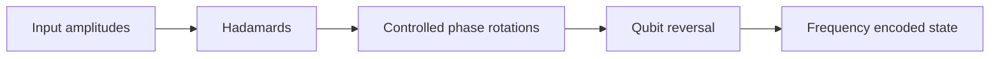

# Quantum Fourier Transform

## Intuition

The Quantum Fourier Transform maps computational basis amplitudes into frequency-phase information. It is the engine behind phase estimation, order finding, and many hidden-period algorithms.

## Step-by-Step

1. Apply Hadamard to the most significant qubit.
2. Apply controlled phase rotations conditioned on lower qubits.
3. Repeat recursively across the register.
4. Swap qubits to reverse endianness.

## Circuit Diagram

## Complexity

Exact QFT uses `O(n^2)` gates. Approximate QFT can drop small rotations for better depth.

## Applications

Phase estimation, Shor's algorithm, quantum signal processing, period finding, and frequency analysis.

## Limitations

Measurement reveals sampled frequency information, not a full classical Fourier vector.

