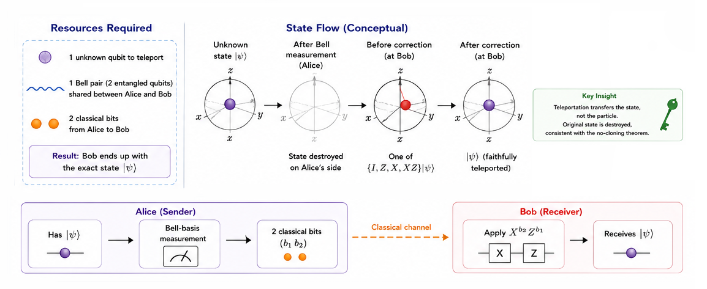
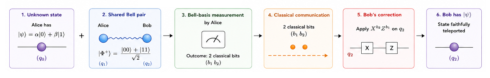
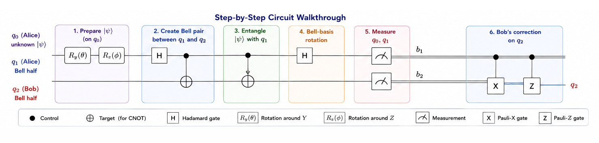
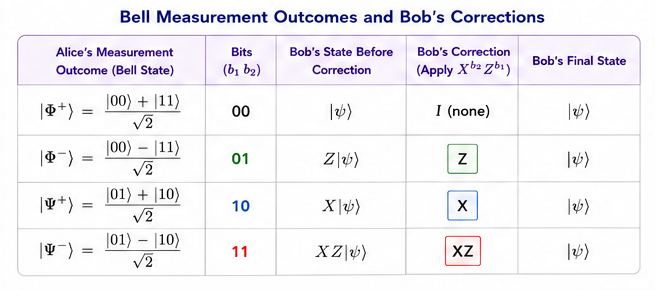

# Quantum Teleportation

<div align="center">

**Transfer an unknown quantum state using entanglement and classical communication.**

`Proposed: 1993 (Bennett et al.) · First Demonstrated: 1997 (Bouwmeester et al.)`

</div>

---

## Table of Contents

- [Historical Background](#historical-background)
- [Problem Statement](#problem-statement)
- [Classical vs Quantum](#classical-vs-quantum)
- [How It Works — Intuition](#how-it-works--intuition)
- [Mathematical Formulation](#mathematical-formulation)
- [Step-by-Step Circuit Walkthrough](#step-by-step-circuit-walkthrough)
- [Complexity Analysis](#complexity-analysis)
- [Implementation Notes](#implementation-notes)
- [Applications](#applications)
- [Limitations & Caveats](#limitations--caveats)
- [Future Scope](#future-scope)
- [References](#references)

---

## Historical Background

Quantum teleportation was proposed in 1993 by **Charles Bennett, Gilles Brassard, Claude Crépeau, Richard Jozsa, Asher Peres, and William Wootters** — a collaboration that bridged quantum information theory and experimental physics. Their paper showed that an unknown quantum state could be "transmitted" from one location to another using only a shared entangled pair and two bits of classical communication.

The name "teleportation" was deliberately provocative. The protocol does not move matter or energy faster than light — it transfers *quantum information* (a qubit state) while destroying the original, consistent with the **no-cloning theorem**.

The first experimental demonstration came in 1997 when **Bouwmeester et al.** (Innsbruck) teleported the polarisation state of a photon. Since then, teleportation has been demonstrated over increasing distances — including 1,400 km via China's Micius satellite in 2017 — and across different physical platforms (photons, ions, superconducting qubits).

Teleportation is now understood as a fundamental primitive, not just a curiosity. It underpins **gate teleportation** (a key technique in fault-tolerant quantum computing), **quantum repeaters** (for long-distance quantum communication), and **measurement-based quantum computing**.

---

## Problem Statement

**Given**: An unknown quantum state $|\psi\rangle = \alpha|0\rangle + \beta|1\rangle$ held by Alice.

**Goal**: Transfer $|\psi\rangle$ to a distant party Bob, such that Bob's qubit ends up in exactly the state $|\psi\rangle$.

**Constraints**:
- Alice does not know $\alpha$ and $\beta$ (so she cannot simply communicate them classically).
- The no-cloning theorem prohibits copying: the original must be destroyed.
- Only a classical communication channel connects Alice and Bob (plus a pre-shared entangled pair).

---

## Classical vs Quantum



| Approach | Can Transfer Unknown State? | Required Resources | State Preserved? |
|---|:---:|---|:---:|
| Classical message | ✗ (can't specify unknown state) | — | N/A |
| Send the qubit physically | ✓ | Quantum channel | ✓ |
| **Quantum teleportation** | **✓** | **1 Bell pair + 2 classical bits** | **✓ (original destroyed)** |

The remarkable feature is that teleportation replaces a *quantum channel* with a *pre-shared entangled pair* plus *classical communication*. This is enormously useful because entanglement can be distributed in advance (stored in quantum memory), while quantum channels suffer from losses and decoherence during transmission.

---

## How It Works — Intuition




**Analogy**: Imagine Alice has a unique painting and wants Bob to have an exact copy — but copying is forbidden. Instead:

1. Alice and Bob each hold one half of a "quantum carbon paper" (entangled pair).
2. Alice presses her painting against her half of the carbon paper and examines the result (Bell-basis measurement). This destroys both the painting and Alice's half of the carbon paper.
3. Alice tells Bob two numbers (the classical bits).
4. Bob uses those numbers to adjust his half of the carbon paper, and the painting appears on his side.

---

## Mathematical Formulation

### Setup

Alice holds the unknown state:
$$|\psi\rangle_A = \alpha|0\rangle + \beta|1\rangle$$

Alice and Bob share a Bell pair:
$$|\Phi^+\rangle_{A'B} = \frac{|00\rangle + |11\rangle}{\sqrt{2}}$$

The total 3-qubit state is:
$$|\Psi\rangle = |\psi\rangle_A \otimes |\Phi^+\rangle_{A'B}$$

### Bell-Basis Decomposition

The key identity is:

$$
|\psi\rangle_A |\Phi^+\rangle_{A'B} = \frac{1}{2}\Big[
|\Phi^+\rangle_{AA'} \cdot |\psi\rangle_B +
|\Phi^-\rangle_{AA'} \cdot Z|\psi\rangle_B +
|\Psi^+\rangle_{AA'} \cdot X|\psi\rangle_B +
|\Psi^-\rangle_{AA'} \cdot XZ|\psi\rangle_B
\Big]
$$

### Measurement & Correction

When Alice performs a Bell-basis measurement on her two qubits $(A, A')$, she gets one of four outcomes with equal probability $\frac{1}{4}$:

| Alice's Outcome | Bob's State | Correction |
|---|---|---|
| $\|\Phi^+\rangle$ (bits `00`) | $\|\psi\rangle$ | None (I) |
| $\|\Phi^-\rangle$ (bits `01`) | $Z\|\psi\rangle$ | Apply Z |
| $\|\Psi^+\rangle$ (bits `10`) | $X\|\psi\rangle$ | Apply X |
| $\|\Psi^-\rangle$ (bits `11`) | $XZ\|\psi\rangle$ | Apply XZ |

After Bob applies the correction $X^{b_2} Z^{b_1}$, he has the exact state $|\psi\rangle$.

### Why It Works

The Bell-basis measurement *projects* the three-qubit system into one of four subspaces. In each subspace, Bob's qubit is related to $|\psi\rangle$ by a known Pauli operation. The classical bits tell Bob which Pauli to undo. This process consumes the entanglement: after teleportation, the Bell pair is no longer entangled.

---

## Step-by-Step Circuit Walkthrough






| Step | Operation | State Description |
|---:|---|---|
| 1 | $R_y(\theta) R_z(\phi)$ on q₀ | Prepare $\|\psi\rangle = \alpha\|0\rangle + \beta\|1\rangle$ on q₀ |
| 2 | H on q₁, CNOT(q₁→q₂) | Create Bell pair $\|\Phi^+\rangle$ between q₁ and q₂ |
| 3 | CNOT(q₀→q₁) | Entangle $\|\psi\rangle$ with Alice's Bell qubit |
| 4 | H on q₀ | Complete Bell-basis rotation |
| 5 | Measure q₀, q₁ | Get 2 classical bits $(b_1, b_2)$ |
| 6 | $X^{b_2}$ on q₂ | Bit correction |
| 7 | $Z^{b_1}$ on q₂ | Phase correction |

**Result**: q₂ is now in state $|\psi\rangle$.

---

## Complexity Analysis

| Resource | Amount |
|---|---|
| Qubits (Alice) | 2 (data + Bell half) |
| Qubits (Bob) | 1 (Bell half) |
| Entangled pairs consumed | 1 |
| Classical bits communicated | 2 |
| Quantum gates | 5 (Ry, Rz, H, 2×CNOT + corrections) |
| Circuit depth | O(1) |

---

## Implementation Notes

### Running the Code

```bash
pip install 'qiskit>=1.0' qiskit-aer
python implementation.py
```

### What the Output Shows

1. **Circuit diagram** of the full teleportation protocol
2. **Fidelity verification** for 7 different test states (including $|0\rangle$, $|1\rangle$, $|+\rangle$, $|-\rangle$, $|{+i}\rangle$, and arbitrary states)
3. **Measurement statistics** from 8,192 shots

### Implementation Approach

The implementation uses the **deferred measurement** pattern: instead of mid-circuit measurement + classical feed-forward (which requires dynamic circuits), the corrections are applied as controlled-X and controlled-Z gates. This is mathematically equivalent and works on all simulator backends.

---

## Applications

| Domain | Application |
|---|---|
| **Quantum Networks** | Long-distance quantum state transfer without a direct quantum channel |
| **Quantum Repeaters** | Entanglement swapping (teleportation of entanglement) extends range |
| **Gate Teleportation** | Implement difficult gates by teleporting through pre-prepared "magic states" — key to fault tolerance |
| **Measurement-Based QC** | One-way quantum computation consumes cluster states via teleportation-like operations |
| **Distributed Quantum Computing** | Connect quantum processors in different locations into a single logical computer |
| **Quantum Memory** | Teleport states into and out of long-lived quantum memories |

---

## Limitations & Caveats

1. **Classical communication required**: The 2 classical bits must travel at or below the speed of light, so teleportation **cannot** be used for faster-than-light communication.

2. **Entanglement consumption**: Each teleportation consumes one Bell pair. The Bell pair must be pre-distributed, which itself requires a quantum channel (even if it can be done in advance).

3. **No-cloning**: The original state is destroyed during the protocol. This is fundamental, not a limitation of the implementation.

4. **Fidelity in practice**: Real teleportation is limited by the quality of the shared entangled state, gate errors, and measurement imperfections. State-of-the-art fidelities are ~90–99% depending on the platform.

5. **Ancilla overhead**: More complex states (e.g., multi-qubit entangled states) require proportionally more Bell pairs and classical bits.

---

## Future Scope

- **Quantum Internet**: Teleportation is the fundamental operation of a future quantum internet. Research focuses on high-rate entanglement distribution, quantum memories with long coherence times, and quantum repeater architectures.

- **Satellite Quantum Communication**: Following the Micius demonstration (2017), multiple nations are developing satellite-based quantum communication networks using teleportation protocols.

- **Gate Teleportation for Fault Tolerance**: Magic-state distillation + gate teleportation is the leading approach for implementing non-Clifford gates in surface-code quantum computers.

- **Continuous-Variable Teleportation**: Extending teleportation from discrete qubits to continuous-variable systems (optical modes) for quantum-optical computing and sensing.

- **Hybrid Classical-Quantum Networking**: Integrating teleportation protocols with classical network infrastructure for practical quantum key distribution and distributed quantum computing.

- **Multi-Party Teleportation**: Generalising to controlled teleportation, multi-hop teleportation, and port-based teleportation for more flexible quantum network architectures.

---

## References

1. **Bennett, C. H., Brassard, G., Crépeau, C., Jozsa, R., Peres, A., & Wootters, W. K.** (1993). *Teleporting an Unknown Quantum State via Dual Classical and Einstein-Podolsky-Rosen Channels.* Physical Review Letters, 70(13), 1895–1899. [DOI: 10.1103/PhysRevLett.70.1895](https://doi.org/10.1103/PhysRevLett.70.1895)
2. **Bouwmeester, D., Pan, J.-W., Mattle, K., Eibl, M., Weinfurter, H., & Zeilinger, A.** (1997). *Experimental Quantum Teleportation.* Nature, 390, 575–579. [DOI: 10.1038/37539](https://doi.org/10.1038/37539)
3. **Ren, J.-G., et al.** (2017). *Ground-to-satellite quantum teleportation.* Nature, 549, 70–73. [DOI: 10.1038/nature23675](https://doi.org/10.1038/nature23675) (Preprint: [arXiv:1707.00934](https://arxiv.org/abs/1707.00934))
4. **Pirandola, S., Eisert, J., Weedbrook, C., Furusawa, A., & Braunstein, S. L.** (2015). *Advances in Quantum Teleportation.* Nature Photonics, 9, 641–652. [DOI: 10.1038/nphoton.2015.154](https://doi.org/10.1038/nphoton.2015.154) (Preprint: [arXiv:1505.07831](https://arxiv.org/abs/1505.07831))
5. **Gottesman, D., & Chuang, I. L.** (1999). *Demonstrating the viability of universal quantum computation using teleportation and single-qubit operations.* Nature, 402, 390–393. [DOI: 10.1038/46503](https://doi.org/10.1038/46503) (Preprint: [arXiv:quant-ph/9908010](https://arxiv.org/abs/quant-ph/9908010))
6. **Nielsen, M. A., & Chuang, I. L.** (2010). *Quantum Computation and Quantum Information* (10th Anniversary Edition). [Cambridge University Press](https://doi.org/10.1017/CBO9780511976667). Section 1.3.7.
