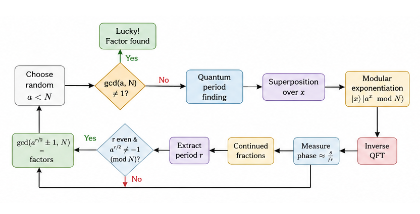
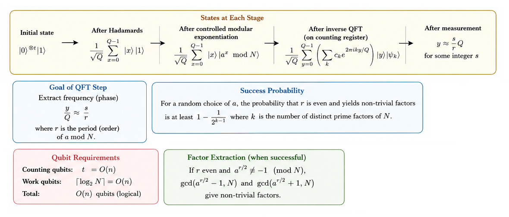
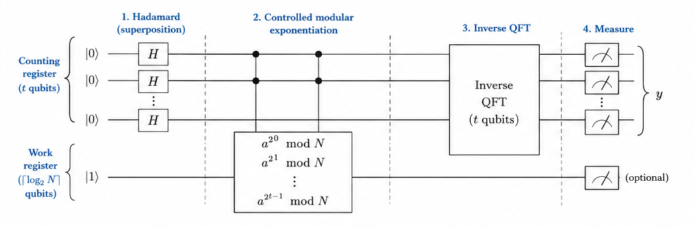
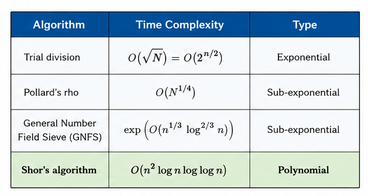

# Shor's Algorithm

<div align="center">

**Polynomial-time integer factorisation on a quantum computer — the algorithm that launched the quantum computing revolution.**

`Proposed: 1994 (Peter Shor) · First Experimental Demo: 2001 (Vandersypen et al., factored 15)`

</div>

---

## Table of Contents

- [Historical Background](#historical-background)
- [Problem Statement](#problem-statement)
- [Classical vs Quantum](#classical-vs-quantum)
- [How It Works — Intuition](#how-it-works--intuition)
- [Mathematical Formulation](#mathematical-formulation)
- [Step-by-Step Circuit Walkthrough](#step-by-step-circuit-walkthrough)
- [Continued Fractions](#continued-fractions)
- [Complexity Analysis](#complexity-analysis)
- [Implementation Notes](#implementation-notes)
- [Applications](#applications)
- [Limitations & Caveats](#limitations--caveats)
- [Future Scope](#future-scope)
- [References](#references)

---

## Historical Background

On an April day in 1994, **Peter Shor**, then at AT&T Bell Labs, presented an algorithm that could factor integers in polynomial time on a quantum computer. The impact was immediate and seismic.

The security of **RSA encryption** — protecting banking, military communications, and the entire internet — rests on the assumption that factoring large numbers is computationally intractable. The best known classical algorithms (General Number Field Sieve) run in sub-exponential time $\exp(O(n^{1/3} \log^{2/3} n))$ for an $n$-bit number. Shor's algorithm reduces this to **polynomial time** $O(n^2 \log n \log \log n)$ — an exponential (technically superpolynomial) speedup.

This discovery single-handedly transformed quantum computing from an academic curiosity into a matter of national security. It sparked massive investment in quantum hardware, launched the field of **post-quantum cryptography**, and remains the strongest motivation for building large-scale quantum computers.

The first experimental demonstration came in 2001 when **Vandersypen et al.** at IBM used a 7-qubit NMR quantum computer to factor 15 into 3 × 5. While this was a compiled demonstration (not scalable), it proved the algorithm works in practice.

Shor's algorithm was directly inspired by **Daniel Simon's** 1994 algorithm for finding hidden XOR-masks. Shor adapted Simon's "quantum sampling + classical post-processing" framework from the group $\mathbb{Z}_2^n$ to the cyclic group $\mathbb{Z}_N$, replacing the Hadamard transform with the Quantum Fourier Transform.

---

## Problem Statement

**Given**: A composite integer $N = p \times q$ (where $p, q$ are unknown primes).

**Goal**: Find the factors $p$ and $q$.

**Reduction to period finding**: Shor showed that factoring reduces to finding the **order** (period) $r$ of a random element $a$ modulo $N$:

$$a^r \equiv 1 \pmod{N}$$

Once $r$ is known, factors can be extracted classically via $\gcd(a^{r/2} \pm 1, N)$.

---

## Classical vs Quantum

| Algorithm | Time Complexity | Type |
|---|---|---|
| Trial division | $O(\sqrt{N}) = O(2^{n/2})$ | Exponential |
| Pollard's rho | $O(N^{1/4})$ | Sub-exponential |
| General Number Field Sieve (GNFS) | $\exp\!\big(O(n^{1/3} \log^{2/3} n)\big)$ | Sub-exponential |
| **Shor's algorithm** | **$O(n^2 \log n \log \log n)$** | **Polynomial** |

For a 2048-bit RSA modulus:
- GNFS: estimated $\sim 10^{30}$ operations (infeasible)
- Shor: estimated $\sim 10^{12}$ operations — but requires millions of physical qubits with error correction

---

## How It Works — Intuition




**Analogy — Tuning a Quantum Radio:**

Imagine modular exponentiation $a^x \bmod N$ as a signal with a hidden frequency (the period $r$). Classically, you'd need to compute many values and look for repetition. Shor's algorithm instead:

1. Creates a quantum superposition of *all* values $a^0, a^1, a^2, \dots$ simultaneously.
2. Applies the QFT — the quantum equivalent of a spectrum analyser — to extract the frequency.
3. Reads off the period from the frequency peak.

---

## Mathematical Formulation



### Step 1: Classical Pre-Processing

1. Pick random $a \in \{2, \dots, N-1\}$.
2. Check $\gcd(a, N)$. If $> 1$, we're done (lucky factor).
3. Check if $N$ is a prime power. If so, factor directly.

### Step 2: Quantum Order Finding

**Objective**: Find the smallest $r > 0$ such that $a^r \equiv 1 \pmod{N}$.

**Quantum register setup**: Use $t$ counting qubits (for precision) and $\lceil \log_2 N \rceil$ work qubits.

**Initial state**:
$$|0\rangle^{\otimes t}|1\rangle$$

**After Hadamards on counting register**:
$$\frac{1}{\sqrt{Q}}\sum_{x=0}^{Q-1}|x\rangle|1\rangle \quad \text{where } Q = 2^t$$

**After controlled modular exponentiation**:
$$\frac{1}{\sqrt{Q}}\sum_{x=0}^{Q-1}|x\rangle|a^x \bmod N\rangle$$

**After inverse QFT on counting register**, measuring yields values $y$ close to:
$$\frac{y}{Q} \approx \frac{s}{r} \quad \text{for some integer } s \in \{0, 1, \dots, r-1\}$$

### Step 3: Classical Post-Processing

Use **continued fractions** to find the best rational approximation $s/r$ to the measured phase $y/Q$ with $r < N$. The denominator $r$ is the candidate period.

### Step 4: Factor Extraction

If $r$ is even and $a^{r/2} \not\equiv -1 \pmod{N}$:

$$a^r - 1 = (a^{r/2} - 1)(a^{r/2} + 1) \equiv 0 \pmod{N}$$

Then $\gcd(a^{r/2} - 1, N)$ and $\gcd(a^{r/2} + 1, N)$ give non-trivial factors with high probability.

### Success Probability

For a random choice of $a$, the probability that $r$ is even and yields non-trivial factors is at least $1 - \frac{1}{2^{k-1}}$ where $k$ is the number of distinct prime factors of $N$. For $N = pq$ (two primes), this is $\geq 1/2$. With $O(\log \log N)$ random choices, success is near-certain.

---

## Step-by-Step Circuit Walkthrough




For $N = 15$, $a = 7$, with 8 counting qubits:


**Key stages:**
1. **Counting register**: 8 qubits in uniform superposition — encodes all exponents $x = 0, 1, \dots, 255$.
2. **Controlled modular exponentiation**: For each counting qubit $k$, apply $|y\rangle \to |7^{2^k} \cdot y \bmod 15\rangle$ controlled on qubit $k$.
3. **Inverse QFT**: Transforms the counting register into phase/frequency information.
4. **Measurement**: Read out the phase estimate $y/256 \approx s/r$.

**Expected peaks for $a = 7$, $N = 15$ (period $r = 4$)**:
$y \in \{0, 64, 128, 192\}$ corresponding to $s/r \in \{0/4, 1/4, 2/4, 3/4\}$.

---

## Continued Fractions

The continued fraction algorithm converts a decimal approximation into the best rational approximation with a small denominator.

**Example**: Measured $y = 192$ from $Q = 256$ counting qubits.

$$\frac{y}{Q} = \frac{192}{256} = 0.75 = \frac{3}{4}$$

The continued fraction expansion of $0.75$ gives denominator $r = 4$.

**For less clean measurements** (e.g., $y = 191$):

$$\frac{191}{256} \approx 0.7461 \approx \frac{3}{4}$$

The continued fractions algorithm correctly identifies $r = 4$ as the best small-denominator approximation.

**Python approach**:
```python
from fractions import Fraction
r = Fraction(y, Q).limit_denominator(N).denominator
```

---

## Complexity Analysis




| Component | Complexity |
|---|---|
| Modular exponentiation circuit | $O(n^3)$ gates (can be improved to $O(n^2 \log n)$) |
| QFT | $O(n^2)$ gates |
| Continued fractions | $O(n)$ classical |
| GCD computation | $O(n^2)$ classical (Euclidean algorithm) |
| **Total quantum** | **$O(n^3)$** gates, $O(n)$ qubits |
| Repetitions needed | $O(1)$ expected (constant number of random $a$ choices) |

For an $n$-bit number $N$:
- **Quantum gates**: $O(n^2 \log n \log \log n)$ with optimised arithmetic
- **Logical qubits**: $O(n)$ ≈ $2n + 3$ for standard implementation
- **Physical qubits** (with error correction): estimated $O(n \cdot \text{polylog}(n))$ — millions for RSA-2048

---

## Implementation Notes

### Running the Code

```bash
pip install 'qiskit>=1.0' qiskit-aer
python implementation.py
```

### What the Output Shows

1. **Classical period finding** for all valid bases modulo 15
2. **Quantum circuit statistics** (qubit count, gate count, depth)
3. **Quantum simulation** (4,096 shots) with measurement histogram
4. **Period extraction** via continued fractions with voting
5. **Factor verification**: $15 = 3 \times 5$
6. **Classical Shor pipeline** for numbers up to 143

### Implementation Details

- **Compiled modular exponentiation**: For $N = 15$, the modular multiplication gates are pre-compiled into SWAP networks (not general arithmetic circuits).
- **8 counting qubits**: Provides sufficient precision ($Q = 256 > 15^2$) for unambiguous period extraction.
- **Classical fallback**: For $N > 15$, the implementation uses classical period finding (since general modular exponentiation circuits are very deep).

---

## Applications

| Domain | Impact |
|---|---|
| **RSA cryptanalysis** | A sufficiently large quantum computer could break RSA encryption |
| **Discrete logarithm** | Shor's algorithm extends to DLP, breaking Diffie-Hellman and elliptic curve cryptography |
| **Post-quantum cryptography** | Motivated the development of lattice-based, hash-based, and code-based cryptosystems (NIST PQC standardisation) |
| **Quantum complexity theory** | Placed factoring in BQP — evidence that BQP ⊃ BPP |
| **Phase estimation** | The order-finding subroutine generalises to quantum phase estimation — used across quantum chemistry, simulation, and machine learning |
| **Quantum resource estimation** | Shor's algorithm is the primary benchmark for estimating when quantum computers will be "cryptographically relevant" |

---

## Limitations & Caveats

1. **Massive qubit requirements**: Factoring a 2048-bit RSA modulus requires an estimated 4,000+ logical qubits, each composed of thousands of physical qubits for error correction. Total: **millions of physical qubits**.

2. **Current hardware gap**: The largest number factored by a general quantum algorithm on quantum hardware is 21 (factored in 2012). Current devices have 50–1000+ noisy qubits — far from the fault-tolerant regime.

3. **Compiled demonstrations**: Most "Shor's algorithm" demonstrations (including $N = 15$) use pre-compiled circuits that encode knowledge of the answer. True scalable implementations require general modular arithmetic circuits.

4. **Not a near-term threat**: Despite media hype, RSA is safe for the foreseeable future. The timeline for "cryptographically relevant quantum computers" is estimated at 10–30+ years.

5. **Modular exponentiation bottleneck**: The quantum modular exponentiation circuit dominates the resource cost. Optimising this circuit is an active research area.

6. **Random base selection**: The algorithm may need multiple random bases $a$ before finding one that yields useful factors. This is a constant-factor overhead, not a fundamental limitation.

---

## Future Scope

- **Resource Estimation**: Ongoing research into more efficient quantum arithmetic circuits, aiming to reduce the physical qubit requirements from millions to potentially hundreds of thousands.

- **Post-Quantum Cryptography**: NIST finalised its first post-quantum standards in 2024 (CRYSTALS-Kyber, CRYSTALS-Dilithium, SPHINCS+, FALCON). Migration is underway but will take decades.

- **Quantum-Safe Migration ("Y2Q")**: Organisations are beginning "harvest now, decrypt later" threat assessments and transitioning to hybrid classical-quantum-safe protocols.

- **Better Modular Exponentiation**: Research into windowed arithmetic, Karatsuba-style quantum multiplication, and constant-space modular exponentiation circuits.

- **Shor for Elliptic Curves**: Adapting the algorithm for elliptic curve discrete logarithms — potentially requiring fewer qubits than RSA factoring.

- **Quantum Phase Estimation Improvements**: Iterative phase estimation, Bayesian phase estimation, and robust phase estimation reduce qubit requirements at the cost of more measurements.

- **Error-Corrected Demonstrations**: The next milestone is factoring numbers beyond classical brute-force capability using error-corrected logical qubits — likely the first "quantum advantage" for a useful mathematical problem.

---

## References

1. **Shor, P. W.** (1994). *Algorithms for Quantum Computation: Discrete Logarithms and Factoring.* Proceedings of the 35th Annual IEEE Symposium on Foundations of Computer Science (FOCS), 124–134. [DOI: 10.1109/SFCS.1994.365700](https://doi.org/10.1109/SFCS.1994.365700)
2. **Shor, P. W.** (1997). *Polynomial-Time Algorithms for Prime Factorization and Discrete Logarithms on a Quantum Computer.* SIAM Journal on Computing, 26(5), 1484–1509. [DOI: 10.1137/S0097539795293172](https://doi.org/10.1137/S0097539795293172) (Preprint: [arXiv:quant-ph/9508027](https://arxiv.org/abs/quant-ph/9508027))
3. **Vandersypen, L. M. K., Steffen, M., Breyta, G., Yannoni, C. S., Sherwood, M. H., & Chuang, I. L.** (2001). *Experimental realization of Shor's quantum factoring algorithm using nuclear magnetic resonance.* Nature, 414, 883–887. [DOI: 10.1038/414883a](https://doi.org/10.1038/414883a) (Preprint: [arXiv:quant-ph/0112176](https://arxiv.org/abs/quant-ph/0112176))
4. **Gidney, C., & Ekerå, M.** (2021). *How to factor 2048 bit RSA integers in 8 hours using 20 million noisy qubits.* Quantum, 5, 433. [DOI: 10.22331/q-2021-04-15-433](https://doi.org/10.22331/q-2021-04-15-433) (Preprint: [arXiv:1905.09749](https://arxiv.org/abs/1905.09749))
5. **Beauregard, S.** (2003). *Circuit for Shor's algorithm using 2n+3 qubits.* Quantum Information & Computation, 3(2), 175–185. [DOI: 10.48550/arXiv.quant-ph/0205095](https://doi.org/10.48550/arXiv.quant-ph/0205095) (Preprint: [arXiv:quant-ph/0205095](https://arxiv.org/abs/quant-ph/0205095))
6. **Nielsen, M. A., & Chuang, I. L.** (2010). *Quantum Computation and Quantum Information* (10th Anniversary Edition). [Cambridge University Press](https://doi.org/10.1017/CBO9780511976667). Section 5.3.
