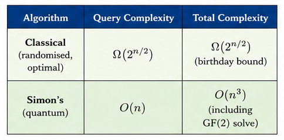
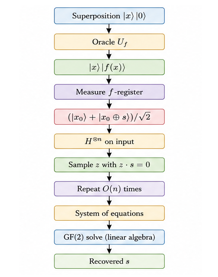
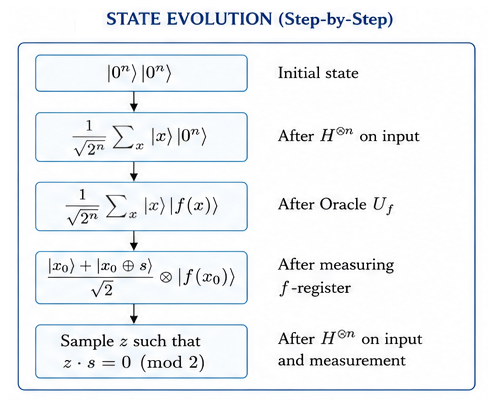
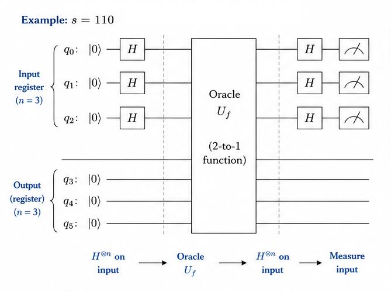
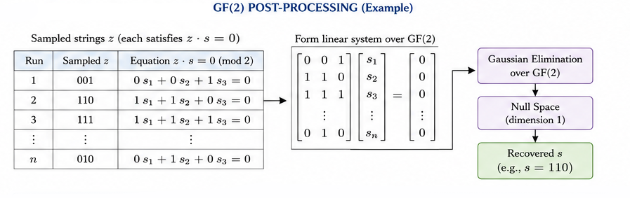

# Simon's Algorithm

<div align="center">

**The first quantum algorithm to demonstrate an exponential speedup over classical — and the direct inspiration for Shor's factoring algorithm.**

`Proposed: 1994 (Daniel Simon) · Published: 1997 (SIAM Journal on Computing)`

</div>

---

## Table of Contents

- [Historical Background](#historical-background)
- [Problem Statement](#problem-statement)
- [Classical vs Quantum](#classical-vs-quantum)
- [How It Works — Intuition](#how-it-works--intuition)
- [Mathematical Formulation](#mathematical-formulation)
- [Step-by-Step Circuit Walkthrough](#step-by-step-circuit-walkthrough)
- [GF(2) Post-Processing](#gf2-post-processing)
- [Complexity Analysis](#complexity-analysis)
- [Implementation Notes](#implementation-notes)
- [Applications](#applications)
- [Limitations & Caveats](#limitations--caveats)
- [Future Scope](#future-scope)
- [References](#references)

---

## Historical Background

**Daniel Simon** presented this algorithm at FOCS 1994, and it represented a watershed moment in quantum computing theory. While Deutsch-Jozsa and Bernstein-Vazirani showed quantum advantages in contrived settings, Simon's algorithm demonstrated the first **exponential oracle separation** between quantum and classical randomised computation — not just deterministic.

The problem Simon solved — finding a hidden XOR-mask in a 2-to-1 function — was specifically designed to be easy for quantum computers but provably hard classically (in the oracle model). This structure deeply influenced **Peter Shor**, who attended Simon's talk and later adapted the core idea of "finding hidden periodicity via quantum sampling" to construct his famous factoring algorithm.

Simon's algorithm thus occupies a unique place in the history of quantum computing: it is the critical link between the toy examples (Deutsch-Jozsa) and the practically devastating algorithms (Shor). Without Simon's insight, Shor's algorithm might not have been discovered — or at least not in 1994.

---

## Problem Statement

**Given**: A function $f: \{0,1\}^n \to \{0,1\}^n$ implemented as a quantum oracle, with the **promise** that there exists a secret string $s \in \{0,1\}^n$ such that:

$$f(x) = f(y) \iff y = x \oplus s$$

- If $s = 0^n$: the function is 1-to-1 (injective).
- If $s \neq 0^n$: the function is 2-to-1, with each output having exactly two pre-images related by XOR with $s$.

**Goal**: Determine $s$.

---

## Classical vs Quantum



| Algorithm | Query Complexity | Total Complexity |
|---|:---:|:---:|
| Classical (randomised, optimal) | $\Omega(2^{n/2})$ | $\Omega(2^{n/2})$ (birthday bound) |
| **Simon's (quantum)** | **$O(n)$** | **$O(n^3)$** (including GF(2) solve) |

This is an **exponential** speedup: $O(n)$ vs $\Omega(2^{n/2})$. The classical lower bound comes from the birthday paradox — you need $\Theta(\sqrt{2^n})$ samples before two inputs are likely to collide.

---

## How It Works — Intuition



**Think of it as quantum surveying:**

1. Query the oracle in superposition — you get a quantum state containing *all* input-output pairs simultaneously.
2. Measuring the output register "collapses" the input register to a pair $|x_0\rangle + |x_0 \oplus s\rangle$ (two inputs that map to the same output).
3. Applying Hadamard to this pair produces a random string $z$ that is *orthogonal* to $s$: $z \cdot s = 0 \pmod{2}$.
4. Each quantum run gives one equation. After $O(n)$ runs, you have enough independent equations to solve for $s$ using linear algebra over GF(2).

---

## Mathematical Formulation



### Step-by-Step State Evolution

**Step 1**: Initial state
$$|0^n\rangle|0^n\rangle$$

**Step 2**: Hadamard on first register
$$\frac{1}{\sqrt{2^n}}\sum_{x \in \{0,1\}^n}|x\rangle|0^n\rangle$$

**Step 3**: Oracle
$$\frac{1}{\sqrt{2^n}}\sum_{x}|x\rangle|f(x)\rangle$$

**Step 4**: Measure second register (get some value $f(x_0)$). First register collapses to:
$$\frac{|x_0\rangle + |x_0 \oplus s\rangle}{\sqrt{2}}$$

**Step 5**: Hadamard on first register:
$$\frac{1}{\sqrt{2}} \left( H^{\otimes n}|x_0\rangle + H^{\otimes n}|x_0 \oplus s\rangle \right)$$

$$= \frac{1}{\sqrt{2^{n+1}}} \sum_z \left[ (-1)^{x_0 \cdot z} + (-1)^{(x_0 \oplus s) \cdot z} \right] |z\rangle$$

$$= \frac{1}{\sqrt{2^{n+1}}} \sum_z (-1)^{x_0 \cdot z} \left[ 1 + (-1)^{s \cdot z} \right] |z\rangle$$

### Orthogonality Condition

The amplitude of $|z\rangle$ contains the factor $[1 + (-1)^{s \cdot z}]$:

- If $s \cdot z = 0$: factor = 2, so $|z\rangle$ has non-zero amplitude.
- If $s \cdot z = 1$: factor = 0, so $|z\rangle$ is never measured.

**Conclusion**: Every measured $z$ satisfies $z \cdot s = 0 \pmod{2}$.

---

## Step-by-Step Circuit Walkthrough



For $s = 110$ (3 qubits):

**Oracle construction for $s = 110$:**
1. Copy input register to output: $|x\rangle|0\rangle \to |x\rangle|x\rangle$
2. Make it 2-to-1: when $x_1 = 1$ (the pivot bit of $s$), XOR output with $s$.

---

## GF(2) Post-Processing




After $O(n)$ quantum runs, we have a system of equations:

$$
\begin{cases}
z^{(1)} \cdot s = 0 \pmod{2} \\
z^{(2)} \cdot s = 0 \pmod{2} \\
\vdots \\
z^{(k)} \cdot s = 0 \pmod{2}
\end{cases}
$$

This is a homogeneous linear system over the **Galois Field GF(2)** (arithmetic modulo 2, where addition = XOR).

### Solving the System

1. **Gaussian elimination**: Row-reduce the matrix of $z$ vectors over GF(2).
2. **Null space**: The solution $s$ lies in the null space of this matrix.
3. **Uniqueness**: With $n-1$ linearly independent equations, the null space is 1-dimensional, uniquely determining the non-zero $s$ (up to the trivial solution $s = 0$).

### Example

For $s = 110$, possible samples:

| Sample $z$ | Equation $z \cdot s$ |
|:---:|---|
| `001` | $0 \cdot 1 + 0 \cdot 1 + 1 \cdot 0 = 0$ ✓ |
| `110` | $1 \cdot 1 + 1 \cdot 1 + 0 \cdot 0 = 0$ ✓ |
| `111` | $1 \cdot 1 + 1 \cdot 1 + 1 \cdot 0 = 0$ ✓ |

After Gaussian elimination → $s = 110$.

---

## Complexity Analysis

| Resource | Quantum (Simon) | Classical (Birthday) |
|---|:---:|:---:|
| Oracle queries | $O(n)$ | $\Theta(2^{n/2})$ |
| Qubits | $2n$ | $O(n)$ bits |
| Classical post-processing | $O(n^3)$ (Gaussian elimination) | $O(2^{n/2})$ |
| Success probability | $1 - 2^{-\Omega(n)}$ | Requires $\Theta(2^{n/2})$ queries |
| Total time | $O(n^3)$ | $\Theta(2^{n/2})$ |

The exponential separation is in **query complexity**: $O(n)$ vs $\Omega(2^{n/2})$.

---

## Implementation Notes

### Running the Code

```bash
pip install 'qiskit>=1.0' qiskit-aer
python implementation.py
```

### What the Output Shows

1. **Circuit diagram** for one round of Simon's algorithm
2. **Collected samples** $z$ with orthogonality verification ($z \cdot s = 0$)
3. **GF(2) Gaussian elimination** to recover $s$
4. **Verification** that recovered $s$ matches the secret

### Test Cases

- $s = 11$ (2-bit)
- $s = 110$ (3-bit)
- $s = 101$ (3-bit)
- $s = 1001$ (4-bit)

---

## Applications

| Domain | Application |
|---|---|
| **Hidden subgroup problems** | Simon's problem is the hidden subgroup problem for $\mathbb{Z}_2^n$ — the simplest non-trivial HSP |
| **Shor's algorithm** | Direct inspiration: Shor adapted "find hidden periodicity via quantum sampling" to the cyclic group $\mathbb{Z}_N$ |
| **Quantum complexity theory** | First exponential separation between BQP and BPP in the oracle model |
| **Symmetric cryptanalysis** | Simon-type attacks break certain symmetric constructions (e.g., Even-Mansour in the quantum setting) |
| **Period finding** | Generalised period-finding algorithms for different group structures |

---

## Limitations & Caveats

1. **Promise oracle**: The function must be *exactly* 2-to-1 with XOR structure. Approximate or noisy oracles break the guarantees.

2. **Classical post-processing**: The GF(2) system must be solved classically, taking $O(n^3)$ time. This dominates the total runtime but is polynomial.

3. **Probabilistic sampling**: Each quantum run gives a *random* equation satisfying $z \cdot s = 0$. We need $O(n)$ independent equations, and independence is only guaranteed with high probability (not certainty).

4. **Oracle construction**: For general functions, constructing the oracle circuit may require exponential resources — the algorithm's advantage is strictly in the query model.

5. **No practical applications**: Unlike Shor (which breaks RSA), Simon's algorithm solves a problem that rarely arises naturally. Its value is theoretical and pedagogical.

---

## Future Scope

- **Quantum Attacks on Symmetric Cryptography**: Simon's algorithm has been used to construct quantum attacks on modes of operation (e.g., CBC-MAC, Even-Mansour cipher) in the quantum chosen-plaintext model. This is an active area in post-quantum cryptography.

- **Hidden Subgroup Problem**: Simon's problem is the HSP for $\mathbb{Z}_2^n$. Generalising to non-abelian groups (e.g., the symmetric group $S_n$) could solve graph isomorphism — a major open problem.

- **Quantum Walks for Simon-Type Problems**: Quantum walk algorithms provide alternative approaches to hidden structure problems, potentially with better noise resilience.

- **Hybrid Quantum-Classical Algorithms**: Using Simon-type sampling as a subroutine in larger hybrid algorithms for structured search and optimisation.

- **Error-Resilient Variants**: Developing versions of Simon's algorithm that tolerate noisy oracles or approximate periodicity.

---

## References

1. **Simon, D. R.** (1994). *On the Power of Quantum Computation.* Proceedings of the 35th Annual IEEE Symposium on Foundations of Computer Science (FOCS), 116–123. [DOI: 10.1109/SFCS.1994.365701](https://doi.org/10.1109/SFCS.1994.365701)
2. **Simon, D. R.** (1997). *On the Power of Quantum Computation.* SIAM Journal on Computing, 26(5), 1474–1483. [DOI: 10.1137/S0097539796298637](https://doi.org/10.1137/S0097539796298637)
3. **Shor, P. W.** (1994). *Algorithms for Quantum Computation: Discrete Logarithms and Factoring.* Proceedings of the 35th Annual IEEE Symposium on Foundations of Computer Science (FOCS), 124–134. [DOI: 10.1109/SFCS.1994.365700](https://doi.org/10.1109/SFCS.1994.365700)
4. **Kaplan, M., Leurent, G., Leverrier, A., & Naya-Plasencia, M.** (2016). *Breaking Symmetric Cryptosystems Using Quantum Period Finding.* Advances in Cryptology – CRYPTO 2016, 207–237. [DOI: 10.1007/978-3-662-53008-5_8](https://doi.org/10.1007/978-3-662-53008-5_8) (Preprint: [arXiv:1505.07831](https://arxiv.org/abs/1505.07831))
5. **Nielsen, M. A., & Chuang, I. L.** (2010). *Quantum Computation and Quantum Information* (10th Anniversary Edition). [Cambridge University Press](https://doi.org/10.1017/CBO9780511976667). Section 5.4.
