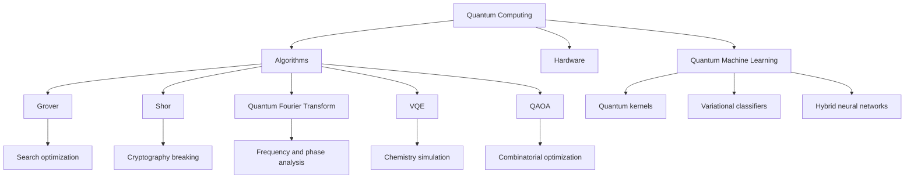
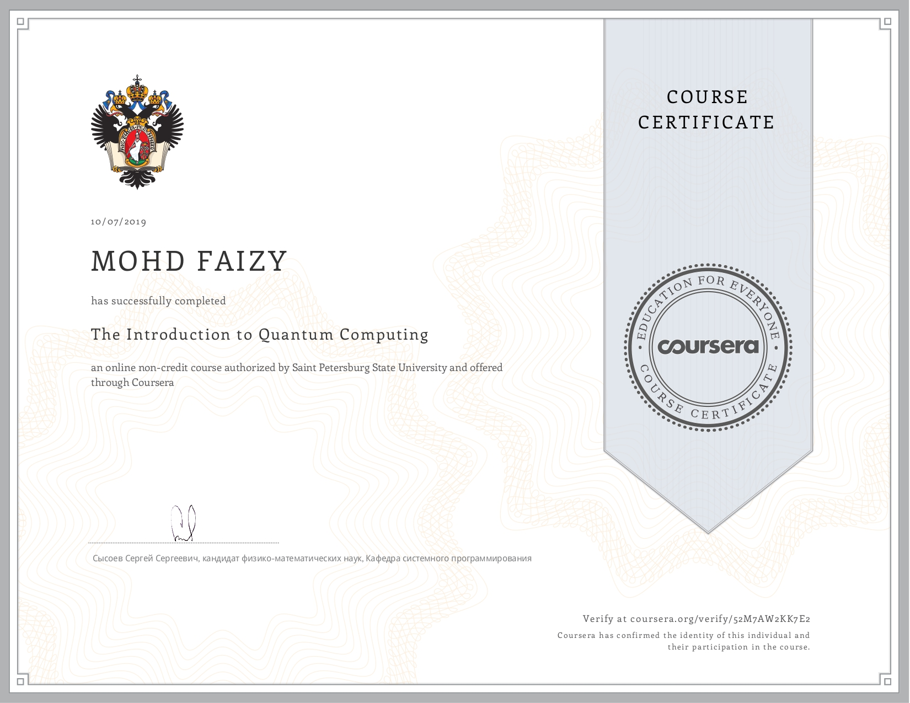
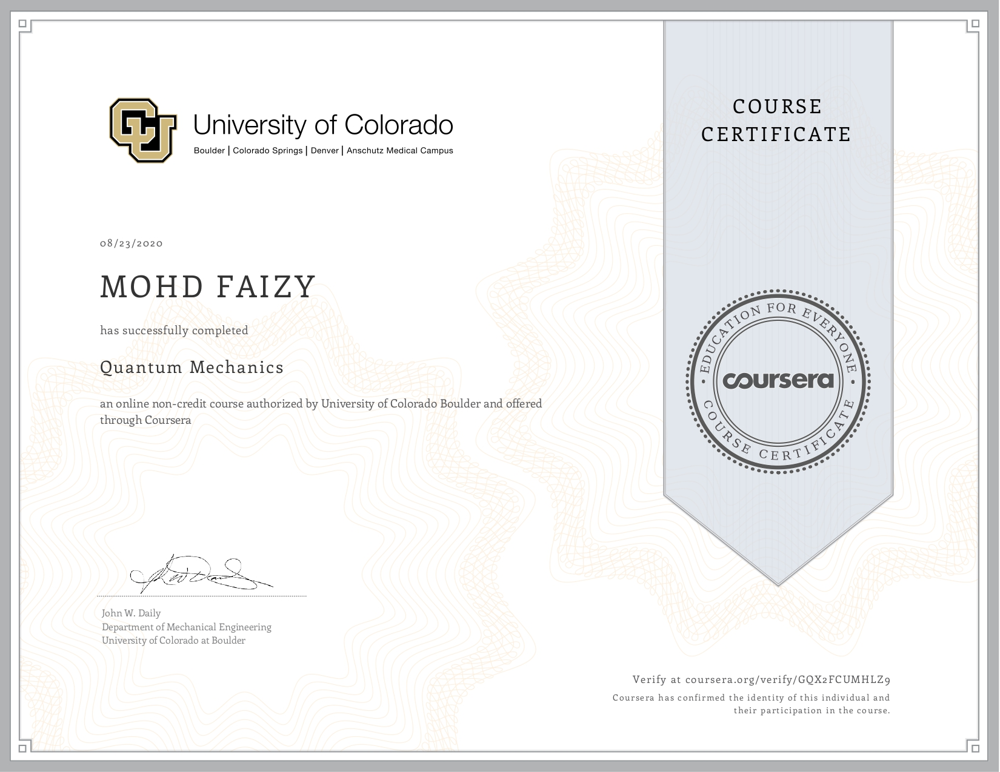

# Quantum Computing, Quantum Machine Learning, and Quantum Algorithms

An open, executable learning hub for quantum computing, quantum machine learning (QML), quantum algorithms, hardware progress, and research literacy. Each major algorithm includes theory, math, implementation, and visualization material, while the code lab provides runnable examples for `Qiskit`, `PennyLane`, `Cirq`, TensorFlow Quantum, and hybrid workflows.

## Overview

Quantum computing has moved from isolated demonstrations to cloud-accessible processors, error-mitigation workflows, modular hardware roadmaps, and hybrid quantum-classical software stacks. The field is still pre-fault-tolerant for most practical workloads, but the direction is clear: high-quality qubits, better calibration, circuit knitting, quantum error correction, and quantum-centric supercomputing are converging.

Quantum machine learning matters because many future datasets will be generated by quantum systems: molecules, materials, sensors, and strongly correlated physics. QML explores whether parameterized quantum circuits, quantum kernels, and quantum feature maps can represent useful structure that is costly for classical models to capture directly.

Hybrid classical-quantum systems are the dominant near-term pattern. A classical optimizer proposes parameters, a quantum circuit evaluates a state or expectation value, and classical post-processing updates the model. This is the foundation for VQE, QAOA, variational quantum classifiers, quantum kernels, and chemistry simulation demos.

## Repository Map

```text
Quantum-Algorithms/      Algorithm notes, math, circuits, and examples
quantum_code_lab/        Runnable Python examples and demos
IBM-Qiskit/              Beginner-friendly Qiskit learning track
TensorFlow-Quantum/      TensorFlow Quantum beginner track
credentials/             Course certificates and learning record
.github/workflows/       CI checks for Python examples
```

## Quantum Companies and 2026 Progress Report

Hardware numbers change quickly. Counts below use public information available around June 2026 and should be read as public device scale, not proof of practical advantage.

| Company/ecosystem | Representative processor | Public qubit scale | Architecture | Key progress |
|---|---:|---:|---|---|
| IBM Quantum | Heron r3, Nighthawk, Condor demo chip | Heron r3: 156; Nighthawk: 120; Condor demo: 1,121 | Superconducting tunable-coupler | Higher-fidelity Heron revisions, Nighthawk square-lattice workloads, roadmap toward advantage by end of 2026 and fault tolerance by 2029. |
| Google Quantum AI | Willow | 105 | Superconducting | Demonstrated below-threshold surface-code scaling evidence and random-circuit benchmark on Willow. |
| D-Wave | Advantage2 | 4,400+ | Quantum annealing, Zephyr topology | Generally available annealing system with 40,000+ couplers and improved connectivity/noise profile. |
| IonQ | Forte / Forte Enterprise | 36 algorithmic qubits | Trapped ion | Commercial cloud access with high-connectivity trapped-ion architecture and algorithmic-qubit reporting. |
| Rigetti | Cepheus-1-108Q, Ankaa family | 108 | Superconducting modular chiplets | 108-qubit QPU on Amazon Braket and continued multi-chip superconducting scaling. |
| Xanadu | Aurora, Borealis lineage | Modular photonic system; Borealis reported 216 squeezed modes | Photonic continuous-variable / modular photonics | Aurora demonstrated networked modular photonic architecture aimed at scalable fault tolerance. |
| Microsoft Azure Quantum | Majorana 1 research chip and partner hardware | 8 topological-device building blocks publicly discussed; partner QPUs vary | Topological research plus cloud marketplace | Majorana/topoconductor research path and Azure Quantum access to partner systems. |
| Amazon Braket ecosystem | IonQ, Rigetti, QuEra, IQM, Oxford Quantum Circuits, AQT and simulators | Provider-dependent | Trapped ion, superconducting, neutral atom, annealing via partners | Unified managed service for heterogeneous QPUs, simulators, jobs, hybrid workflows, and reservations. |
| Quantinuum | H2 series | 56 | Trapped ion | All-to-all connectivity, high quantum volume, and production H-Series access. |

Sources: [IBM Quantum technology](https://www.ibm.com/quantum/technology/), [IBM Nighthawk announcement](https://quantum.cloud.ibm.com/announcements/en/product-updates/2026-01-05-nighthawk), [Google Willow announcement](https://blog.google/technology/ai/google-ai-updates-december-2024/), [D-Wave Advantage2](https://support.dwavesys.com/hc/en-us/articles/32105885880087-D-Wave-s-Advantage2-Quantum-Computer-Now-Generally-Available), [IonQ Forte](https://www.ionq.com/quantum-systems/forte), [Rigetti Cepheus on Braket](https://www.rigetti.com/news/amazon-braket-launches-rigetti-cepheus-1-108q-superconducting-device), [Xanadu Aurora](https://www.xanadu.ai/press/xanadu-introduces-aurora-worlds-first-scalable-networked-and-modular-quantum-computer), [Amazon Braket providers](https://aws.amazon.com/braket/hardware-providers/), [Quantinuum H2 reference](https://docs.quantinuum.com/systems/support/system_reference.html), [Microsoft Quantum hardware](https://quantum.microsoft.com/en-us/solutions/azure-quantum-hardware).

## Quantum Processors Map 2026

| Processor | Organization | Qubits or modes | Architecture | Performance notes | Best-fit use cases |
|---|---|---:|---|---|---|
| IBM Condor | IBM | 1,121 | Superconducting | Large-scale chip demonstration; not the highest-fidelity public workhorse. | Scaling research, packaging, control-system learning. |
| IBM Heron r3 | IBM | 156 | Superconducting | Lower two-qubit error rates than earlier IBM generations. | Utility-scale circuit experiments, Qiskit workflows. |
| IBM Nighthawk | IBM | 120 | Superconducting square lattice | More couplers and topology for deeper workload exploration. | Quantum-centric supercomputing experiments. |
| Google Willow | Google Quantum AI | 105 | Superconducting | Error-correction scaling milestone and benchmark demonstration. | Error correction research, sampling benchmarks. |
| IonQ Forte | IonQ | 36 algorithmic qubits | Trapped ion | Fully connected trapped-ion style programming model. | Compact algorithms, chemistry, optimization prototypes. |
| Quantinuum H2 | Quantinuum | 56 | Trapped ion | All-to-all connectivity and high circuit quality. | Algorithms needing nonlocal interactions. |
| D-Wave Advantage2 | D-Wave | 4,400+ | Annealing | Zephyr topology with 40,000+ couplers. | QUBO/Ising optimization, sampling, hybrid annealing. |
| Rigetti Cepheus-1-108Q | Rigetti | 108 | Superconducting modular | Chiplet-based scaling via Braket access. | Gate-model research and cloud benchmarking. |
| Xanadu Aurora | Xanadu | Modular photonic system | Photonic | Networked photonic racks toward fault-tolerant modularity. | Photonic architecture research and continuous-variable methods. |

## Quantum Algorithm Ecosystem Map




## Learning Tracks

1. Foundations: qubits, gates, measurement, entanglement, Dirac notation.
2. Algorithms: Deutsch-Jozsa, Bernstein-Vazirani, Simon, Grover, QFT, Shor.
3. Near-term methods: VQE, QAOA, quantum kernels, hybrid optimization.
4. Hardware literacy: superconducting, trapped ion, photonic, neutral atom, annealing, topological research.
5. Research practice: reproduce small circuits, read papers, compare hardware assumptions, document limitations.

## Modules

| Module | Focus |
|---|---|
| [Grover](Quantum-Algorithms/grover_algorithm/README.md) | Amplitude amplification for unstructured search. |
| [Shor](Quantum-Algorithms/shor_algorithm/README.md) | Period finding and integer factorization. |
| [Deutsch-Jozsa](Quantum-Algorithms/deutsch_jozsa/README.md) | Constant vs balanced oracle separation. |
| [Bernstein-Vazirani](Quantum-Algorithms/bernstein_vazirani/README.md) | Hidden bit-string recovery. |
| [Simon](Quantum-Algorithms/simon_algorithm/README.md) | Hidden XOR mask and period structure. |
| [Quantum Fourier Transform](Quantum-Algorithms/quantum_fourier_transform/README.md) | Fourier analysis over computational basis states. |
| [Quantum Teleportation](Quantum-Algorithms/quantum_teleportation/README.md) | Entanglement-assisted state transfer. |
| [Entanglement](Quantum-Algorithms/entanglement/README.md) | Bell states, correlations, and nonclassical resources. |

## Code Base

The [quantum code lab](quantum_code_lab/) includes:

- `basic_quantum_circuits.py`
- `bell_states.py`
- `quantum_fourier_transform.py`
- `grover_search.py`
- `shor_algorithm_demo.py`
- `qml_hybrid_model.py`
- `tensorflow_classifier.py`
- `tensorflow_quantum_pqc.py`
- `sympy_quantum_math.py`
- `vqe_molecule_simulation.py`
- `cli.py`

The [TensorFlow Quantum](TensorFlow-Quantum/) folder has a separate beginner track:

- `01_cirq_circuit_basics.py`
- `02_tfq_circuit_tensor.py`
- `03_expectation_layer.py`
- `04_pqc_layer.py`
- `05_tiny_quantum_classifier.py`
- `06_data_reuploading_circuit.py`

Run a demo:

```bash
python quantum_code_lab/grover_search.py
python quantum_code_lab/cli.py grover
python TensorFlow-Quantum/04_pqc_layer.py
```

Install the unified quantum/QML stack:

```bash
pip install -r requirements.txt
```

## Quantum Machine Learning

QML examples live in `quantum_code_lab/` so the concepts stay close to runnable code. The repository covers Variational Quantum Circuits, Quantum Neural Networks, quantum feature maps, hybrid training loops, dataset encoding strategies, barren plateaus, noise, and trainability limits through small scripts.

## Visualization Strategy

Prefer diagrams and plots that can be edited or regenerated:

- Diagrams in Markdown.
- Qiskit/Cirq/PennyLane circuit drawers.
- Matplotlib Bloch spheres and measurement histograms.
- Small scripts for parameter sweeps.

## Current Limitations

Most examples are small by design so they run on laptops and CI. Hardware tables are public snapshots, not vendor benchmarks. QML examples are educational demonstrations and should not be interpreted as proven speedups.

## Certificates

| Introduction to Quantum Computing | Quantum Mechanics |
| :---: | :---: |
|  |  |

## Major Quantum Research Papers

This reading list uses source links and short notes so it stays lightweight and easy to maintain.

| Paper | Year | Area | Link | What it contains |
|---|---:|---|---|---|
| Simulating Physics with Computers | 1982 | Quantum simulation | [DOI](https://doi.org/10.1007/BF02650179) | Feynman's argument that quantum systems are naturally difficult for classical computers and motivate quantum simulators. |
| Quantum Mechanical Computers | 1985 | Universal quantum computing | [DOI](https://doi.org/10.1098/rspa.1985.0070) | Deutsch's formal model of a universal quantum computer and quantum parallelism. |
| Quantum Cryptography: Public Key Distribution and Coin Tossing | 1984 | Quantum cryptography | [DOI](https://doi.org/10.1016/j.tcs.2014.05.025) | BB84 quantum key distribution and the security intuition behind measurement disturbance. |
| Rapid Solution of Problems by Quantum Computation | 1992 | Oracle algorithms | [DOI](https://doi.org/10.1098/rspa.1992.0167) | Deutsch-Jozsa algorithm showing a query advantage for promise problems. |
| Algorithms for Quantum Computation: Discrete Logarithms and Factoring | 1994 | Shor algorithm | [DOI](https://doi.org/10.1109/SFCS.1994.365700) | Period finding, factoring, discrete logarithms, and the cryptographic impact of fault-tolerant quantum computing. |
| Quantum Computations with Cold Trapped Ions | 1995 | Trapped-ion hardware | [DOI](https://doi.org/10.1103/PhysRevLett.74.4091) | Cirac-Zoller trapped-ion gate proposal using shared motional modes. |
| Scheme for Reducing Decoherence in Quantum Computer Memory | 1995 | Error correction | [DOI](https://doi.org/10.1103/PhysRevA.52.R2493) | Shor's quantum error-correcting code and the foundation for protecting logical qubits. |
| A Fast Quantum Mechanical Algorithm for Database Search | 1996 | Grover algorithm | [DOI](https://doi.org/10.1145/237814.237866) | Amplitude amplification and quadratic speedup for unstructured search. |
| An Exact Quantum Polynomial-Time Algorithm for Simon's Problem | 1997 | Hidden subgroup algorithms | [DOI](https://doi.org/10.1137/S0097539796298637) | Simon's hidden XOR-mask problem, a key precursor to Shor-style period finding. |
| Fault-Tolerant Quantum Computation | 1998 | Fault tolerance | [DOI](https://doi.org/10.1098/rspa.1998.0167) | Preskill's framework for reliable computation from noisy quantum gates. |
| Topological Quantum Computation | 2003 | Topological QC | [DOI](https://doi.org/10.1016/S0003-4916(02)00018-0) | Kitaev's anyon-based model and topological protection concepts. |
| A One-Way Quantum Computer | 2001 | Measurement-based QC | [DOI](https://doi.org/10.1103/PhysRevLett.86.5188) | Cluster-state computation where measurements drive the algorithm. |
| Efficient Classical Simulation of Slightly Entangled Quantum Computations | 2003 | Simulation theory | [DOI](https://doi.org/10.1103/PhysRevLett.91.147902) | Shows how limited entanglement can make some quantum computations classically simulable. |
| Adiabatic Quantum Computation Is Equivalent to Standard Quantum Computation | 2004 | Adiabatic QC | [DOI](https://doi.org/10.1137/S0097539705447323) | Establishes equivalence between adiabatic and circuit-model quantum computation. |
| Quantum Approximate Optimization Algorithm | 2014 | QAOA | [arXiv](https://arxiv.org/abs/1411.4028) | Introduces QAOA for approximate combinatorial optimization with alternating phase and mixing operators. |
| The Variational Quantum Eigensolver | 2014 | VQE/chemistry | [DOI](https://doi.org/10.1038/ncomms5213) | Hybrid quantum-classical energy estimation for molecular simulation. |
| Barren Plateaus in Quantum Neural Network Training Landscapes | 2018 | QML trainability | [DOI](https://doi.org/10.1038/s41467-018-07090-4) | Explains exponentially vanishing gradients in broad classes of random variational circuits. |
| Supervised Learning with Quantum-Enhanced Feature Spaces | 2019 | Quantum kernels | [DOI](https://doi.org/10.1038/s41586-019-0980-2) | Quantum feature maps and kernel classification using hard-to-simulate feature spaces. |
| Quantum Supremacy Using a Programmable Superconducting Processor | 2019 | Hardware benchmark | [DOI](https://doi.org/10.1038/s41586-019-1666-5) | Google's random-circuit sampling experiment on Sycamore. |
| TensorFlow Quantum: A Software Framework for Quantum Machine Learning | 2020 | QML software | [arXiv](https://arxiv.org/abs/2003.02989) | Cirq circuits integrated with TensorFlow/Keras for hybrid quantum-classical models. |
| Power of Data in Quantum Machine Learning | 2021 | QML theory | [DOI](https://doi.org/10.1038/s41467-021-22539-9) | Studies when quantum data and data access assumptions can support meaningful QML advantage. |
| Quantum Advantage with a Programmable Photonic Processor | 2022 | Photonic QC | [DOI](https://doi.org/10.1038/s41586-022-04725-x) | Borealis photonic Gaussian boson sampling and programmable photonic advantage claims. |
| Evidence for the Utility of Quantum Computing Before Fault Tolerance | 2023 | NISQ utility | [DOI](https://doi.org/10.1038/s41586-023-06096-3) | IBM error-mitigated experiments arguing for useful pre-fault-tolerant quantum computation. |
| Logical Quantum Processor Based on Reconfigurable Atom Arrays | 2023 | Neutral atoms/error correction | [DOI](https://doi.org/10.1038/s41586-023-06927-3) | Logical-qubit operations and error-correction primitives with reconfigurable neutral atoms. |
| Quantum Error Correction Below the Surface Code Threshold | 2024 | Error correction | [DOI](https://doi.org/10.1038/s41586-024-08449-y) | Google Willow result showing improved logical behavior as code distance increases. |

## License

This repository is released under the existing [MIT License](LICENSE).
